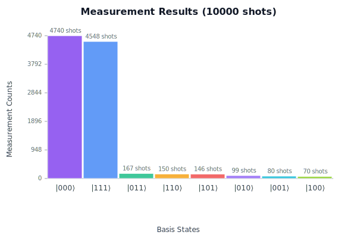

# QClojure Quantum Computing Tutorial
This tutorial will guide you through the basics of quantum computing using
[QClojure](https://github.com/lsolbach/qclojure).

The tutorial demonstrates the use of the QClojure. It will introduce you
to the fascinating world of quantum computing and show you how to use
QClojure to create and run quantum programs. It covers

* the creation and visualization of quantum states and quantum registers
* the application of quantum gates
* the creation, visualization and simulation of quantum circuits
* the export and import of quantum data
* the exchange of quantum circuits with other frameworks
* the use of ideal and realistic quantum simulator backends
* the optimization of quantum circuits for specific hardware topologies
* the use of error mitigation techniques
* the description and execution of quantum and hybrid algorithms


## The Tutorial as a Notebook
The tutorial is written as a literate programming notebook, in a style
called 'Namespace as a Notebook', which means that the code and the
documentation are interleaved. You can read the notebook in an editor and
run the code snippets in a Clojure REPL.


### Reproducible Notebooks
You can also generate documentation with [Clay](https://github.com/scicloj/clay).
With Clay a notebook can be rendered to HTML or via [Quarto](https://quarto.org/)
to various formats like PDF, revealjs presentations or Github flavoured markdown.
Quarto also supports articles, books and websites, so you can easily create an
article, book or website from your notebooks.

Generating notebooks with Clay always produces **reproducible** results, as
the code is in the namespace is executed during the rendering process
in a deterministic way. Even with quarto, the code is executed by Clay,
not by Quarto or yupiter, so the results are always the same, no matter how often
you render the notebook.


## Introduction to Quantum Computing
Quantum computing is a fascinating field that combines computer science,
physics and math. It allows us to perform computations that are
not possible with classical computers. Quantum computers use quantum bits,
or [qubits](https://en.wikipedia.org/wiki/Qubit), which can be in a
superposition of states. This means that a qubit can be in a state of 0, 1,
or both at the same time. Quantum computing is based on the principles of
quantum mechanics, which describe the behavior of particles at the quantum
level.

Quantum computing has the potential to revolutionize many fields, including
cryptography, optimization, and machine learning. It can solve certain
problems much faster than classical computers, by performing many
calculations at once.
Quantum Algorithms, such as Shor's algorithm for factoring large numbers
and Grover's algorithm for searching unsorted databases, demonstrate the
power of quantum computing.

Quantum algorithms are defined in terms of quantum gates, which are
operations that can be applied to qubits. Quantum gates manipulate the state
of qubits and can be combined to create quantum circuits.
Quantum circuits are sequences of quantum gates applied to qubits, similar
to classical logic circuits.

For a general introduction to quantum computing, take a look at

* [Quantum Computing](https://en.wikipedia.org/wiki/Quantum_computing)
* [But what is quantum computing? (Grover's Algorithm) - 3blue1brown](https://www.youtube.com/watch?v=RQWpF2Gb-gU) 


## QClojure
The QClojure library provides a Clojure interface to quantum computing concepts.
It allows us to create and manipulate quantum states, gates, and circuits in a functional programming style.
QClojure can also be used to simulate quantum circuits and, by implementing
backends, run them on quantum hardware.

QClojure is focused on the core concepts of quantum computing and provides a
simple and intuitive API to work with quantum states, gates, and circuits.
It also has a comprehensive library of quantum and hybrid algorithms,
including Grover's search algorithm, the Quantum Approximate Optimization
Algorithm (QAOA), and the Variational Quantum Eigensolver (VQE).

QClojure also provides visualization functions to visualize quantum states, circuits
and results, making it easier to understand and debug quantum algorithms.

QClojure is designed to be extensible, allowing the implementation of backends
to run quantum circuits on different quantum hardware. It can also be extended
to specialized domains like quantum chemistry or quantum machine learning.
Those extensions will be available as separate libraries, to keep the core
library focused and lightweight.


### Source Code
The source code is available on [GitHub](https://github.com/lsolbach/qclojure).

[](https://github.com/lsolbach/qclojure)


### Release Artifacts
The release artifacts (JAR files) are available on [Clojars](https://clojars.org/org.soulspace/qclojure).
Click on the badge below to go to the Clojars page of the latest release.

[](https://clojars.org/org.soulspace/qclojure)

QClojure provides citeable releases, so if you use it in your research, you
can cite it. Click on the badge below for the DOI of the latest release.

[](https://doi.org/10.5281/zenodo.17059552)


### Documentation
QClojure provides extensive API documentation, which is available on [CljDoc](https://cljdoc.org/d/org.soulspace/qclojure).

[](https://cljdoc.org/d/org.soulspace/qclojure)


### License
QClojure is open source and licensed under the Eclipse Public License 1.0. 


### Prerequisites
As QClojure is running on Clojure and Clojure itself on the JVM, you need to
have the following prerequisites installed on your system:

* [JDK 11 or higher](https://openjdk.org/install/)
* [Clojure](https://clojure.org/)
* [Leiningen](https://leiningen.org/) or [Clojure CLI](https://clojure.org/guides/getting_started)
  to manage dependencies and run Clojure code.

If you are new to Clojure, I recommend reading the
[Clojure Getting Started Guide](https://clojure.org/guides/getting_started).


### Usage
To use QClojure, you have to include it as a dependency in your Clojure
project.

If you are using Leiningen, add the following dependency to your
`project.clj` file:

```clojure
[org.soulspace/qclojure "0.16.0"]
```

If you are using Clojure CLI, add the following to your `deps.edn` file:

```clojure
{:deps {org.soulspace/qclojure {:mvn/version "0.16.0"}}}
```


### Imports
We use kindly to visualize the output of our code.
Then we import the relevant namespaces for the domain concepts of the
QClojure library.
The `state` namespace provides functions to create and manipulate quantum
states.
The `gate` namespace provides functions to create quantum gates.
The `circuit` namespace provides functions to create and manipulate quantum
circuits.

We also import the visualization namespace and the svg renderer.
```clj
(ns tutorial
  (:require
   [fastmath.core :as fm]
   [scicloj.kindly.v4.kind :as kind]
   [org.soulspace.qclojure.domain.state :as state]
   [org.soulspace.qclojure.domain.gate :as gate]
   [org.soulspace.qclojure.domain.circuit :as circuit]
   [org.soulspace.qclojure.application.visualization :as viz]
   [org.soulspace.qclojure.adapter.visualization.ascii :as ascii]
   [org.soulspace.qclojure.adapter.visualization.svg :as svg]
   [org.soulspace.qclojure.application.hardware-optimization :as hwopt]
   [fastmath.optimization :as optim]))
```
Some namespaces, like visualization namespaces contain multimethod
implementations. To make sure that the implementations are loaded, we
require the namespaces. They will not be used directly in the code, only
indirectly by calling the multimethod, so a warning might be shown by
your IDE. 


## Quantum States
A quantum state is a mathematical object that describes the state of a
quantum system.
In QClojure, quantum states are represented as vectors of complex numbers.
The vector of complex numbers represents the amplitudes of the basis states,
which represent the possible states of the system.
The notation |⟩ is called a "[braket](https://en.wikipedia.org/wiki/Dirac_notation)"
and is used to represent a vector in a complex vector space.
The Qubit is the basic unit of quantum information, and it can be in a
[superposition](https://en.wikipedia.org/wiki/Superposition) of the states
|0⟩ and |1⟩.
A classic bit can be in one of two states, 0 or 1, but a qubit can be in
a superposition of both states.
This means that a qubit can represent 0, 1, or both at the same time, with
different probabilities.


### Measurement
Measurement is the process of extracting classical information from a quantum
state. The measurement process is probabilistic, and the probability of
measuring a certain state depends on the amplitudes of the basis states in
the quantum state.
When we measure a quantum state, we collapse it to one of the basis states
with a certain probability. After measurement, the quantum state is no longer
in a superposition, but in one of the basis states.

The result of the measurement is a classical bit, which can be either 0 or 1.
The measurement process is a fundamental aspect of quantum mechanics and is
described by the [Born rule](https://en.wikipedia.org/wiki/Born_rule).
The Born rule states that the probability of measuring a certain state is equal
to the square of the amplitude of that state in the quantum state vector.


### Basic Quantum States
The *state* namespace defines some basic quantum states.
Let's look at the quantum state |0⟩, which is the ground state of a qubit.
```clj
state/|0⟩

;; =>
{:state-vector [[1.0 0.0] [0.0 0.0]], :num-qubits 1}

```
The measured value of a quantum state is probabilistic.
We have a probability of measuring the state |0⟩ as 0, and a probability of
measuring it as 1.

We can visualize the probability distribution of the quantum state |0⟩.
QClojure provides several visualization functions in the
`org.soulspace.qclojure.application.visualization` namespace.
They all take the desired output format as the first argument.
We can use the `:ascii` format to generate an ASCII art representation
and `:hiccup` format to generate an SVG image.
The ASCII format is useful for quick visualizations in the REPL,
while the SVG format is more suitable for embedding in documents like
tutorials, papers or presentations. We tag the code blocks with
`^kind/code` and `^kind/hiccup` to indicate the type of content.
With these tags, the Clay notebook renderer can render the output
appropriately.

Here is the ascii representation of the quantum state |0⟩, which is useful, when you
are working in the REPL.
It shows that the probability of measuring the state |0⟩ results in 0 is 1,
which is certain.
```clj
^kind/code
(viz/visualize-quantum-state :ascii state/|0⟩)

Quantum State Probability Distribution:
|0⟩: ████████████████████████████████████████ 100.0%
State Summary:
Total qubits: 1
Total probability shown: 100.0%
Hidden states (below threshold): 1

```
And this is the SVG representation of the same quantum state.
```clj
^kind/hiccup
(viz/visualize-quantum-state :hiccup state/|0⟩)
```


The [Bloch sphere](https://en.wikipedia.org/wiki/Bloch_sphere) is a
geometrical representation of quantum states.
We can visualize the quantum state |0⟩ as a vector on the Bloch sphere.

First the ASCI representation of the Bloch sphere.
```clj
^kind/code
(viz/visualize-bloch-sphere :ascii state/|0⟩)

Bloch Sphere Visualization:

         ······●●●······         
      ·······       ·······      
    ·····               ·····    
  ····                     ····  
 ····                       ···· 
···                           ···
···                           ···
··                             ··
··              +              ··
··                             ··
···                           ···
···                           ···
 ····                       ···· 
  ····                     ····  
    ·····               ·····    
      ·······       ·······      
         ···············         

State: 1.0+0.0i |0⟩ + 0.0+0.0i |1⟩
Coordinates: θ=0.0°, φ=0.0°
Bloch vector: (0.0, 0.0, 1.0)

Legend: ● = current state, · = sphere outline, + = axes
Distances: |0⟩:0.0, |1⟩:2.0, |+⟩:1.41, |-⟩:1.41, |+i⟩:1.41, |-i⟩:1.41
```
And now the Bloch sphere in SVG format of the same quantum state.
```clj
^kind/hiccup
(viz/visualize-bloch-sphere :hiccup state/|0⟩)
```


The Bloch sphere representation shows that the state |0⟩ is at the north pole
of the sphere.

Let's look at another quantum state, the excited state |1⟩.
```clj
state/|1⟩

;; =>
{:state-vector [[0.0 0.0] [1.0 0.0]], :num-qubits 1}

```
We can visualize the probability distribution of the quantum state |1⟩.
```clj
^kind/hiccup
(viz/visualize-quantum-state :hiccup state/|1⟩)
```


It shows that the probability of measuring the state |1⟩ results in 1 is 1,
which is also certain.
The Bloch sphere representation shows that the state |1⟩ is at the south pole
of the sphere.
```clj
^kind/hiccup
(viz/visualize-bloch-sphere :hiccup state/|1⟩)
```


### Superposition States
Quantum states can also be in a superposition of the ground and excited
states.
Superposition states are linear combinations of the basic quantum states.

Let's look at the quantum state |+⟩, which is a superposition of the ground
and excited states.
The state |+⟩ is defined as (|0⟩ + |1⟩) / √2.
```clj
state/|+⟩

;; =>
{:state-vector [[0.7071067811865475 0.0] [0.7071067811865475 0.0]],
 :num-qubits 1}

```
We can visualize the probability distribution of the quantum state |+⟩.
```clj
^kind/hiccup
(viz/visualize-quantum-state :hiccup state/|+⟩)
```


The Bloch sphere representation shows that the state |+⟩ is on the
equator of the sphere, which means, that the probabilities for
measuring 0 or 1 are the same.
```clj
^kind/hiccup
(viz/visualize-bloch-sphere :hiccup state/|+⟩)
```


The quantum state |-⟩ is another superposition of the ground and
excited states. The state |-⟩ is defined as (|0⟩ - |1⟩) / √2.
```clj
state/|-⟩

;; =>
{:state-vector [[0.7071067811865475 0.0] [-0.7071067811865475 0.0]],
 :num-qubits 1}

```
We can visualize the probability distribution of the quantum state |-⟩.
```clj
^kind/hiccup
(viz/visualize-quantum-state :hiccup state/|-⟩)
```


The Bloch sphere representation shows that the state |-⟩ is also on the
equator of the sphere, but pointing in the opposite direction.
```clj
^kind/hiccup
(viz/visualize-bloch-sphere :hiccup state/|-⟩)
```


### Multi-Qubit States and Quantum Registers
Tensor products can be used to create multi-qubit states from single-qubit
states. For example, the state |00⟩ is the tensor product of two |0⟩ states.
```clj
state/|00⟩

;; =>
{:state-vector [[1.0 0.0] [0.0 0.0] [0.0 0.0] [0.0 0.0]], :num-qubits 2}

```
We can visualize the probability distribution of the quantum state |00⟩.
```clj
^kind/hiccup
(viz/visualize-quantum-state :hiccup state/|00⟩)
```


## Quantum Gates
Quantum gates are operations that can be applied to quantum states.
They are represented as matrices that act on the quantum states.
The *gate* namespace defines several quantum gates.


### Pauli Gates
The [Pauli gates](https://en.wikipedia.org/wiki/Pauli_matrices) are a set of
quantum gates that can be applied to single qubits.

The Pauli-X gate is a quantum gate that flips the state of a qubit around
the X axis which swaps the amplitudes of |0⟩ and |1⟩.
```clj
gate/pauli-x

;; =>
[[[0.0 0.0] [1.0 0.0]] [[1.0 0.0] [0.0 0.0]]]

```
The Pauli-Y gate is a quantum gate that flips the state of a qubit around
the Y axis which swaps the amplitudes of |0⟩ and |1⟩ and also adds a phase.
```clj
gate/pauli-y

;; =>
[[[0.0 0.0] [0.0 -1.0]] [[0.0 1.0] [0.0 0.0]]]

```
The Pauli-Z gate is a quantum gate that flips the state of a qubit around
the Y axis which adds a phase to the state of a qubit.
```clj
gate/pauli-z

;; =>
[[[1.0 0.0] [0.0 0.0]] [[0.0 0.0] [-1.0 0.0]]]

```
The Pauli gates are self inverse, applying the same gate twice results
in the original value.


### Hadamard Gate
The [Hadamard gate](https://en.wikipedia.org/wiki/Hadamard_gate) is a
quantum gate that creates superposition states.
It transforms the state |0⟩ into the state |+⟩ and |1⟩ into the state |-⟩.
The Hadamard gate is defined as the matrix:
```clj
gate/hadamard

;; =>
[[[0.7071067811865475 0.0] [0.7071067811865475 0.0]]
 [[0.7071067811865475 0.0] [-0.7071067811865475 0.0]]]

```
We can apply the Hadamard gate to the state |0⟩ to create the superposition 
state |+⟩.
```clj
(def hadamard-state
  (gate/h-gate state/|0⟩))
```
We can visualize the probability distribution of the Hadamard state.
```clj
^kind/hiccup
(viz/visualize-quantum-state :hiccup hadamard-state)
```


The probability distribution shows that the Hadamard state is in a
superposition of the ground and excited states.
```clj
^kind/hiccup
(viz/visualize-bloch-sphere :hiccup hadamard-state)
```


The Bloch sphere representation shows that the Hadamard state is on the
equator of the sphere.

The Hadamard gate is also self inverse, resulting in the input state again
if applied twice.


### Phase Gates
Phase gates are quantum gates that add a phase to the state of a qubit.

The [S gate](https://en.wikipedia.org/wiki/S_gate) is a phase gate that adds
a phase of π/2 to the state of a qubit.
```clj
gate/s-gate

;; =>
[[[1.0 0.0] [0.0 0.0]] [[0.0 0.0] [0.0 1.0]]]

```
The [S† gate](https://en.wikipedia.org/wiki/S_gate#S%E2%81%BF_gate) is the
inverse of the S gate and adds a phase of -π/2 to the state of a qubit.
```clj
gate/s-dag-gate

;; =>
[[[1.0 0.0] [0.0 0.0]] [[0.0 0.0] [0.0 -1.0]]]

```
The [T gate](https://en.wikipedia.org/wiki/T_gate) is a phase gate that adds
a phase of π/4 to the state of a qubit.
```clj
gate/t-gate

;; =>
[[[1.0 0.0] [0.0 0.0]]
 [[0.0 0.0] [0.7071067811865476 0.7071067811865475]]]

```
The [T† gate](https://en.wikipedia.org/wiki/T_gate#T%E2%81%BF_gate) is the
inverse of the T gate and adds a phase of -π/4 to the state of a qubit.
```clj
gate/t-dag-gate

;; =>
[[[1.0 0.0] [0.0 0.0]]
 [[0.0 0.0] [0.7071067811865476 -0.7071067811865475]]]

```

### Rotation Gates
Rotation gates are quantum gates that rotate the state of a qubit around
the Bloch sphere.

The [RX gate](https://en.wikipedia.org/wiki/Rotation_gate#RX_gate) is a
rotation gate that rotates the state of a qubit around the X axis of the
Bloch sphere.
```clj
(gate/rx-gate fm/-QUARTER_PI)

;; =>
[[[0.9238795325112867 0.0] [0.0 0.3826834323650898]]
 [[0.0 0.3826834323650898] [0.9238795325112867 0.0]]]

```
The [RY gate](https://en.wikipedia.org/wiki/Rotation_gate#RY_gate) is a
rotation gate that rotates the state of a qubit around the Y axis of the
Bloch sphere.
```clj
(gate/ry-gate fm/-QUARTER_PI)

;; =>
[[[0.9238795325112867 0.0] [0.3826834323650898 0.0]]
 [[-0.3826834323650898 0.0] [0.9238795325112867 0.0]]]

```
The [RZ gate](https://en.wikipedia.org/wiki/Rotation_gate#RZ_gate) is a
rotation gate that rotates the state of a qubit around the Z axis of the
Bloch sphere.
```clj
(gate/rz-gate fm/-QUARTER_PI)

;; =>
[[[0.9238795325112867 0.3826834323650898] [0.0 0.0]]
 [[0.0 0.0] [0.9238795325112867 -0.3826834323650898]]]

```

### Controlled Gates
Controlled gates are quantum gates that act on multiple qubits.
They are defined as a combination of a control qubit and a target qubit.
The control qubit determines whether the target qubit is affected by the gate.

The controlled-X gate ([CNOT gate](https://en.wikipedia.org/wiki/CNOT_gate))
is a controlled gate that flips the state of the target qubit  if the control
qubit is in the state |1⟩.
```clj
(gate/cnot-gate)

;; =>
[[[1.0 0.0] [0.0 0.0] [0.0 0.0] [0.0 0.0]]
 [[0.0 0.0] [1.0 0.0] [0.0 0.0] [0.0 0.0]]
 [[0.0 0.0] [0.0 0.0] [0.0 0.0] [1.0 0.0]]
 [[0.0 0.0] [0.0 0.0] [1.0 0.0] [0.0 0.0]]]

```
The controlled-Y gate is a controlled gate that flips the state of the target
qubit and adds a phase if the control qubit is in the state |1⟩.

The controlled-Z gate is a controlled gate that adds a phase to the target
qubit if the control qubit is in the state |1⟩.


## Quantum Circuits
Quantum circuits are sequences of quantum gates applied to quantum states.
The *circuit* namespace provides functions to create and manipulate quantum
circuits.


### Creating a Quantum Circuit
We can create a simple quantum circuit that applies the Hadamard gate to the
state |0⟩.
```clj
(def simple-circuit
  (-> (circuit/create-circuit 1 "Hadamard on qubit 0")
      (circuit/h-gate 0)))
```
We can visualize the quantum circuit as ASCII or SVG, like we did with
quantum states.

Here is the ascii representation of the quantum circuit.
```clj
^kind/code
(viz/visualize-circuit :ascii simple-circuit)

Circuit: Hadamard on qubit 0

q0 |0⟩──────[H]───╫──═
Gates: 1, Depth: 1, Column width: 5
```
And this is the SVG representation of the same quantum circuit.
```clj
^kind/hiccup
(viz/visualize-circuit :hiccup simple-circuit)
```


The circuit shows that the Hadamard gate is applied to the qubit 0.

We can execute the circuit with the `qc/execute-circuit` function
on the state |0⟩ to create the Hadamard state.
```clj
(def hadamard-circuit-result
  (circuit/execute-circuit simple-circuit state/|0⟩))
```
We can visualize the probability distribution of the Hadamard circuit state.
```clj
^kind/hiccup
(viz/visualize-quantum-state :hiccup (:final-state hadamard-circuit-result))
```


The probability distribution shows that the Hadamard circuit state is
in a superposition of the ground and excited states. It is the same as the
Hadamard state we created earlier, but now created by a quantum circuit, not
just the application of a single gate on a quantum state.
```clj
^kind/hiccup
(viz/visualize-bloch-sphere :hiccup (:final-state hadamard-circuit-result))
```


The *circuit* namespace also has some predefined circuits.

For example, the 'qc/bell-state-circuit' creates a circuit that prepares 
Bell state, which is a two-qubit entangled state.
```clj
(def bell-circuit
  (circuit/bell-state-circuit))
```
We can visualize the Bell circuit.
```clj
^kind/hiccup
(viz/visualize-circuit :hiccup bell-circuit)
```


The Bell circuit shows that the Hadamard gate is applied to the first qubit,
followed by a CNOT gate between the first and second qubits.
The Bell state is a two-qubit state that is
[entangled](https://en.wikipedia.org/wiki/Entanglement).
```clj
(def bell-result
  (circuit/execute-circuit bell-circuit (state/zero-state 2)))
```
We can visualize the probability distribution of the Bell state.
```clj
^kind/hiccup
(viz/visualize-quantum-state :hiccup (:final-state bell-result))
```


The *circuit* namespace also has a predefined circuit for multi-qubit states.
This circuit can be used to create entangled states with more than two
qubits.

For example, the `qc/ghz-circuit` creates a circuit that prepares
a Greenberger-Horne-Zeilinger ([GHZ](https://en.wikipedia.org/wiki/Greenberger%E2%80%93Horne%E2%80%93Zeilinger_state))
state.
```clj
(def ghz-circuit
  (circuit/ghz-state-circuit 3))
```
We can visualize the GHZ circuit.
```clj
^kind/hiccup
(viz/visualize-circuit :hiccup ghz-circuit)
```


The GHZ circuit shows that the Hadamard gate is applied to the first qubit,
followed by CNOT gates between the first and second qubits, and between the
first and third qubits. The GHZ state is a multi-qubit state that is entangled.

We can apply the GHZ circuit to the state |000⟩ to create the GHZ state.
```clj
(def ghz-result
  (circuit/execute-circuit ghz-circuit (state/zero-state 3)))
```
We can visualize the probability distribution of the GHZ state.
```clj
^kind/hiccup
(viz/visualize-quantum-state :hiccup (:final-state ghz-result))
```


The probability distribution shows that the GHZ state is in a superposition
of the states |000⟩ and |111⟩.


## Data Format and I/O
Sometimes we want to save quantum circuits or quantum states to disk
or read them from disk.
This is especially useful if we want to share quantum circuits or states
with others or if we want to use quantum circuits or states created
in other quantum computing frameworks.

QClojure supports various input and output formats for quantum circuits
and quantum states. This allows users to easily import and export quantum
circuits and states between different quantum computing frameworks and tools.
The supported formats include:
* Extensible Data Notation (EDN)
* JSON (JavaScript Object Notation)
* QASM (Quantum Assembly Language)

Let's import the I/O namespace providing the API for reading and writing
quantum circuits and quantum states.
```clj
(require '[org.soulspace.qclojure.adapter.io :as io])
```
Now we define some test data to demonstrate the I/O capabilities.
We create a quantum circuit with medium complexity for import and export.
```clj
(def test-circuit
  (-> (circuit/create-circuit 3 "I/O Test Circuit" "A circuit with medium complexity")
      (circuit/h-gate 0)
      (circuit/cnot-gate 0 1)
      (circuit/t-gate 1)
      (circuit/cnot-gate 1 2)
      (circuit/measure-operation [0 1 2])))
```

## EDN Support
EDN (Extensible Data Notation) is a data format that is similar to JSON
but is more expressive and flexible. It is a subset of Clojure syntax
and is used for representing data structures in a human-readable format.
QClojure supports EDN format for importing and exporting quantum circuits
and quantum states.
```clj
(require '[org.soulspace.qclojure.adapter.io.edn :as edn])
```
Let's first write a simple quantum state to disk in EDN format.
```clj
(io/export-quantum-state :edn state/|+⟩ "export/plus-state.edn")

;; =>
nil

```
We can read the quantum state in EDN form back from disk.
```clj
(io/import-quantum-state :edn "export/plus-state.edn")

;; =>
{:state-vector [[0.7071067811865475 0.0] [0.7071067811865475 0.0]],
 :num-qubits 1,
 :metadata {}}

```

## JSON Support
JSON (JavaScript Object Notation) is a lightweight data interchange format
that is easy for humans to read and write and easy for machines to parse
and generate. It is widely used for data exchange between web applications
and servers.
QClojure supports JSON format for importing and exporting quantum circuits
and quantum states. To use JSON I/O capabilities, we need to require
the `io.json` namespace.
```clj
(require '[org.soulspace.qclojure.adapter.io.json :as json])
```
The functions for JSON I/O are the same, just with the different format
keyword `:json`.
Let's write the same quantum state to disk in JSON format.
```clj
(io/export-quantum-state :json state/|+⟩ "export/plus-state.json")

;; =>
nil

```
We can read the quantum state in JSON form back from disk.
```clj
(io/import-quantum-state :json "export/plus-state.json")

;; =>
{:state-vector [[0.7071067811865475 0.0] [0.7071067811865475 0.0]],
 :num-qubits 1,
 :metadata {}}

```

### OpenQASM Support
QASM (Quantum Assembly Language) is a low-level programming language
used to describe quantum circuits. It is a standard format for representing
quantum circuits and is supported by many quantum computing frameworks.
QASM allows us to define quantum gates, measurements, and other operations
in a text-based format that can be easily shared and executed on different
quantum computing platforms.
QASM 3 for example is used as the exchange format for quantum circuits
by Amazon Braket. QASM 2 is supported by IBM Quantum and other
quantum computing frameworks.

QClojure supports QASM 2 and QASM 3 formats, allowing users to import
and export quantum circuits in QASM format. It does not support quantum states
in QASM format, as QASM is primarily used for representing quantum circuits.

Let's require the QASM namespace to explore the QASM I/O capabilities.
```clj
(require '[org.soulspace.qclojure.adapter.io.qasm :as qasm])
```
We can export the quantum circuit to QASM 2 format.
```clj
(io/export-quantum-circuit :qasm2 test-circuit "export/test-circuit-qasm2.qasm")

;; =>
nil

```
To see how the QASM 2 output looks like, we can read the file with slurp.
```clj
^kind/code
(slurp "export/test-circuit-qasm2.qasm")

OPENQASM 2.0;
include "qelib1.inc";
qreg q[3];
creg c[3];

h q[0];
cx q[0],q[1];
t q[1];
cx q[1],q[2];
// Measurement will be handled by final measure statement
measure q -> c;
```
We can read the quantum circuit in QASM 2 format back from disk.
```clj
(io/import-quantum-circuit :qasm2 "export/test-circuit-qasm2.qasm")

;; =>
{:operations
 [{:operation-type :h, :operation-params {:target 0}}
  {:operation-type :cnot, :operation-params {:control 0, :target 1}}
  {:operation-type :t, :operation-params {:target 1}}
  {:operation-type :cnot, :operation-params {:control 1, :target 2}}],
 :num-qubits 3,
 :name "Converted Circuit"}

```
We can also export the quantum circuit to QASM 3 format.
```clj
(io/export-quantum-circuit :qasm3 test-circuit "export/test-circuit-qasm3.qasm")

;; =>
nil

```
To see how the QASM 3 output looks like, we can read the file with slurp.
```clj
^kind/code
(slurp "export/test-circuit-qasm3.qasm")

OPENQASM 3.0;
include "stdgates.inc";

qubit[3] q;
bit[3] c;

h q[0];
cx q[0], q[1];
t q[1];
cx q[1], q[2];
c[0] = measure q[0];
c[1] = measure q[1];
c[2] = measure q[2];
```
We can read the quantum circuit in QASM 3 format back from disk.
```clj
(io/import-quantum-circuit :qasm3 "export/test-circuit-qasm3.qasm")

;; =>
{:operations
 [{:operation-type :h, :operation-params {:target 0}}
  {:operation-type :cnot, :operation-params {:control 0, :target 1}}
  {:operation-type :t, :operation-params {:target 1}}
  {:operation-type :cnot, :operation-params {:control 1, :target 2}}
  {:operation-type :measure,
   :operation-params {:measurement-qubits [0]}}
  {:operation-type :measure,
   :operation-params {:measurement-qubits [1]}}
  {:operation-type :measure,
   :operation-params {:measurement-qubits [2]}}],
 :num-qubits 3,
 :name "Converted Circuit",
 :result-specs {}}

```


## Math Backends for Complex Linear Algebra
Simulating quantum circuits on a classical computer requires efficient
linear algebra operations on complex numbers. QClojure provides a
`domain.math.complex-linear-algebra` namespace that abstracts the underlying complex linear algebra
implementation. This namespace provides the public API for complex linear
algebra operations used in QClojure. It allows to switch between different
implementations of complex linear algebra without changing the QClojure code.

Protocols define the operations that need to be implemented by a
specific complex linear algebra backend implementation:

* MatrixAlgebra - defining basic matrix operations like addition, multiplication,
  products (kronecker/tensor, outer, inner, hadamard), conjugate transpose, etc.
* MatrixDecompositions - defining matrix decompositions like
  singular value decomposition, eigenvalue decomposition, etc.
* MatrixFunctions - defining matrix functions like exponentiation, logarithm, square root, etc.
* MatrixAnalysis - defining matrix analysis functions like spectral norm, condition number, etc.

Currently, QClojure supports two backend implementations:

* Fastmath Backend (`:fastmath`), based on FastMath, a high-performance numerical computing
  library for Clojure. It provides efficient implementations of complex linear
  algebra operations based on Apache Commons Math.
* Pure Clojure Math Backend (`:pure`), based on Clojure Math, a pure Clojure implementation
  of complex linear algebra operations for educational purpose only.

The Fastmath backend is the default backend used by QClojure, as it provides
better performance for large quantum states and circuits. The Clojure Math
backend should be used only for educational purposes or for small quantum states and
circuits.
```clj
(require '[org.soulspace.qclojure.domain.math.complex-linear-algebra :as cla])
```
You can switch between the backends by using the `set-backend` function.
After switching the backend, all complex linear algebra operations
will use the selected backend. Backends may use a different representation
for complex numbers and matrices, but the public API handles the conversion
between the different representations.

The backend can be switched at any time, but it is recommended to set the
backend at the beginning of the program, before any quantum states or
circuits are created.

To switch to the pure Clojure Math backend, use the following code:
```clj
(cla/set-backend! :pure)

;; =>
:pure

```
Now, all complex linear algebra operations will use the pure Clojure Math
backend.

You can switch back to the Fastmath backend by using the following code:
```clj
(cla/set-backend! :fastmath)

;; =>
:fastmath

```
A BLAS/LAPACK (CPU) and OpenCL/CUDA (GPU) enabled backend would be desirable
for simulating larger quantum states and circuits, but is not yet available.


## Quantum Devices and Quantum Computing Backends
A device represents a quantum computer,also known as a Quantum Processing
Unit (QPU), with a certain number of qubits,
a native gate set, a topology of coupled qubits and various kinds of noise.

Devices are handled by backends, which are responsible for executing
quantum circuits on a specific quantum computer or a simulator.
Some backends may only support a single device, while others may support
multiple devices. A device can represent a real quantum computer or a
simulator.
Backends that support multiple devices are called multi-device backends.
For multi-device backends a specific device can be selected on a backend
for the execution of quantum circuits. An example will be shown in the
[Hardware Simulator Backend](#hardware-simulator-backend) section below.

A quantum backend is an adapter for one or more devices to QClojure.
Each backend implements the QuantumBackend protocol. A backend may also
implement more specific protocols, like the CloudQuantumBackend, the
MultiDeviceBackend or the BatchJobBackend protocol.
Backends also provide additional functionality, like optimizing
and transforming quantum circuits to run on a specific quantum device.

QClojure can be extended with backend implementations to run quantum
circuits on real quantum hardware.
The *application.backend* namespace contains the protocols to be implemented
by a specific backend. A backend can be used to execute a quantum circuit.
```clj
(require '[org.soulspace.qclojure.application.backend :as backend])
```
QClojure comes with two simulator backends in the *adapter.backend* that can be used to
simulate quantum circuits on a classical computer.

* The ideal simulator backend simulates an ideal quantum computer without
  physical constraints like noise.
* The hardware simulator backend simulates a real quantum computer with
  a native gate set, a topology of coupled qubits and various kinds of noise.

Additional backends to access quantum hardware will be available as separate
libraries. There is already an experimental implementation for an Amazon
Braket backend available in the [qclojure-braket](https://github.com/lsolbach/qclojure-braket)
project.

Simulating quantum circuits on a classical computer is computationally expensive,
as the state space of a quantum system grows exponentially with the number of qubits.
Therefore, the simulator backends are limited to a certain number of qubits,
depending on the available memory and processing power of the classical computer.
The simulator backends are limited to about 20 qubits on a typical desktop computer.
Also note that the time to simulate a quantum circuit grows exponentially with the
number of qubits and the depth of the circuit.
Therefore, simulating quantum circuits with a large number of qubits or a deep
circuit can take a long time.


## Ideal Simulator Backend
Let's try the ideal simulator first by requiring the `ideal-simulator` namespace.
```clj
(require '[org.soulspace.qclojure.adapter.backend.ideal-simulator :as sim])
```
We create the simulator backend with the `create-simulator` function.
```clj
(def simulator (sim/create-simulator))
```
Now we can use the simulator to execute the ghz circuit on the simulator.
```clj
(backend/execute-circuit simulator (circuit/ghz-state-circuit 3))

;; =>
{:job-status :completed,
 :results
 {:final-state
  {:state-vector
   [[0.7071067811865475 0.0]
    [0.0 0.0]
    [0.0 0.0]
    [0.0 0.0]
    [0.0 0.0]
    [0.0 0.0]
    [0.0 0.0]
    [0.7071067811865475 0.0]],
   :num-qubits 3},
  :result-types #{},
  :circuit-metadata
  {:circuit-depth 3,
   :circuit-operation-count 3,
   :circuit-gate-count 3,
   :num-qubits 3}},
 :execution-time-ms 0,
 :job-id "sim_job_1855_1757952790792"}

```
When executing a circuit on a backend, it will be executed multiple times,
because of the probabilistic nature of quantum computing. One execution of the
circuit is called a *shot*. The default number of shots is 512, but it can be
configured via an options map.
```clj
(backend/execute-circuit simulator (circuit/ghz-state-circuit 3) {:shots 10})

;; =>
{:job-status :completed,
 :results
 {:final-state
  {:state-vector
   [[0.7071067811865475 0.0]
    [0.0 0.0]
    [0.0 0.0]
    [0.0 0.0]
    [0.0 0.0]
    [0.0 0.0]
    [0.0 0.0]
    [0.7071067811865475 0.0]],
   :num-qubits 3},
  :result-types #{},
  :circuit-metadata
  {:circuit-depth 3,
   :circuit-operation-count 3,
   :circuit-gate-count 3,
   :num-qubits 3}},
 :execution-time-ms 2,
 :job-id "sim_job_1856_1757952790896"}

```

## Hardware Simulator Backend
Currently existing real quantum hardware has a set of limitations compared
to what our ideal simulator supports:

* supports only a limited set of native quantum gates
* may have a limited topology of coupled qubits
* is subject to various kinds of noise

This has some consequences for running quantum circuits on real quantum
hardware, also known as Quantum Processing Units (QPUs).
The limited topology means that not all qubits can be used freely in 
a multi-qubit gate, e.g. a CNOT gate. If a CNOT gate should be applied to
qubits which are not coupled in the topology, represente by a coupling map,
Swap gates have to be introduced to 'move' the information to qubits that
are coupled, so that the CNOT gate can be applied. 

The limited native gate set means that our circuit has to be transformed to
only use those native gates. This is done by decomposing unsupported gates
to supported gates.

The hardware simulator backend optimizes and transforms a quantum circuit
on submission to the backend, so that it can be executed on the
simulated quantum hardware.
It optimizes the circuit by reducing the number of gates and the depth
of the circuit. It transforms the circuit by decomposing unsupported gates
to supported gates and by adding Swap gates to respect the coupling map.
Details about the optimization and transformation process are described
in the [Circuit Optimization and Transformation](#circuit-optimization-and-transformation)
section below.

The various kinds of noise affect the results of quantum computations.
They can be addressed by error correction, which uses a number of
physical qubits to form a logical qubit. On current QPUs with limited
qubit counts this is not always an option. Error mitigation strategies try 
to address the problem mathematically or with more executions.

The hardware simulator backend also simulates the noise of a given
quantum device, based on a device map provided to the backend,
allowing us to study the effects of noise on quantum circuits.
It simulates these kinds of noise:

* depolarizing noise is a type of noise that randomly flips the state of a
  qubit with a certain probability.
* amplitude damping noise is a type of noise that causes the state of a
  qubit to decay over time with a certain probability.
* bit flip noise is a type of noise that flips the state of a qubit from
  |0⟩ to |1⟩ or from |1⟩ to |0⟩ with a certain probability.
* phase flip noise is a type of noise that flips the phase of the state of
  a qubit from |0⟩ to |1⟩ or from |1⟩ to |0⟩ with a certain probability.
* readout noise is a type of noise that affects the measurement of the
  state of a qubit, causing the measured value to be incorrect with a
  certain probability.

The hardware simulator backend applies the noise to the quantum states
and gates in the circuit, simulating the effects of noise on the quantum
computation.

Let's try the hardware simulator first by requiring the `hardware-similator` namespace.
```clj
(require '[org.soulspace.qclojure.adapter.backend.hardware-simulator :as hwsim])
```
We can instantiate the hardware simulator with the `create-hardware-simulator` function
and provide a provide a device map. The device map we use here is derived from the
IBM Lagos Quantum Computer.
```clj
(def hardware-simulator (hwsim/create-hardware-simulator))

(backend/select-device hardware-simulator (:ibm-lagos hwsim/device-map))

;; =>
{:native-gates #{:y :rx :z :h :x :rz :ry :cnot},
 :performance
 {:single-qubit-gate-fidelity 0.9995,
  :two-qubit-gate-fidelity 0.994,
  :readout-fidelity 0.972,
  :gate-times {:single-qubit 35.6, :two-qubit 476},
  :coherence-times {:t1 125.0, :t2 89.0}},
 :name "IBM Lagos",
 :connectivity :limited,
 :noise-model
 {:gate-noise
  {:h
   {:noise-type :depolarizing,
    :noise-strength 5.0E-4,
    :t1-time 125.0,
    :t2-time 89.0,
    :gate-time 35.6},
   :x
   {:noise-type :depolarizing,
    :noise-strength 3.0E-4,
    :t1-time 125.0,
    :t2-time 89.0,
    :gate-time 35.6},
   :cnot
   {:noise-type :depolarizing,
    :noise-strength 0.006,
    :t1-time 125.0,
    :t2-time 89.0,
    :gate-time 476.0}},
  :readout-error {:prob-0-to-1 0.013, :prob-1-to-0 0.028}},
 :measurement-basis :computational,
 :id :ibm-lagos,
 :virtual-gates #{:cz :s :swap :t},
 :coupling [[0 1] [1 2] [2 3] [3 4] [4 5] [5 6]],
 :num-qubits 7,
 :provider "IBM",
 :platform "Legacy",
 :topology :linear}

```
The device map shows configurations for the different types of noise,
a physical quantum computer can have. All different types of noise contribute
to the errors in the measurement.
The device map also shows the native gate set and the coupling map of the
qubits, which defines the topology of coupled qubits.

Now we can use the simulator to execute the ghz circuit on the simulator.
Because we use a hardware simulator simulating noise, we may measure wrong
answers.
```clj
(def lagos-50-result (backend/execute-circuit hardware-simulator (circuit/ghz-state-circuit 3) {:shots 50}))

lagos-50-result

;; =>
{:job-status :completed,
 :measurement-results {"111" 25, "000" 21, "001" 2, "011" 1, "100" 1},
 :final-state
 {:num-qubits 3,
  :state-vector
  [[0.7071067811865476 0.0]
   [0.0 0.0]
   [0.0 0.0]
   [0.0 0.0]
   [0.0 0.0]
   [0.0 0.0]
   [0.0 0.0]
   [0.7071067811865476 0.0]]},
 :noise-applied true,
 :shots-executed 50,
 :execution-time-ms 55,
 :job-id "job_28_1757952791001"}


^kind/hiccup
(viz/visualize-quantum-state :hiccup (:final-state lagos-50-result))
```


We see, that not all measurements measure the states |000⟩ and |111⟩,
even though those states should have the highest counts. The other states
should have a distinctively lower count. But if you use to few shots, you
could be unlucky and measure the wrong answers. The probability to measure
the wrong answers gets lower by increasing the number of shots.
```clj
(def lagos-10k-result (backend/execute-circuit hardware-simulator (circuit/ghz-state-circuit 3) {:shots 10000}))

lagos-10k-result

;; =>
{:job-status :completed,
 :measurement-results
 {"000" 4789,
  "111" 4506,
  "011" 134,
  "100" 69,
  "110" 160,
  "101" 161,
  "010" 94,
  "001" 87},
 :final-state
 {:num-qubits 3,
  :state-vector
  [[0.7071067811865476 0.0]
   [0.0 0.0]
   [0.0 0.0]
   [0.0 0.0]
   [0.0 0.0]
   [0.0 0.0]
   [0.0 0.0]
   [0.7071067811865476 0.0]]},
 :noise-applied true,
 :shots-executed 10000,
 :execution-time-ms 3267,
 :job-id "job_29_1757952791104"}

```
With 10000 shots, the difference of the counts of the correct answers
and the counts of the wrong answers should be quite significant.
```clj
^kind/hiccup
(viz/visualize-measurement-histogram :hiccup (:measurement-results lagos-10k-result))
```


We can also use the hardware simulator with a different device map, e.g.
for an IonQ Forte quantum computer.
Let's select IonQ Forte device for the simulation.
```clj
(backend/select-device hardware-simulator (:ionq-forte hwsim/device-map))

;; =>
{:native-gates #{:y :rx :z :h :x :ms :rz :ry :cnot},
 :performance
 {:single-qubit-gate-fidelity 0.9995,
  :two-qubit-gate-fidelity 0.997,
  :readout-fidelity 0.998,
  :gate-times {:single-qubit 30000, :two-qubit 120000},
  :coherence-times {:t1 20000.0, :t2 10000.0}},
 :name "IonQ Forte",
 :connectivity :full,
 :noise-model
 {:gate-noise
  {:h
   {:noise-type :coherent,
    :coherent-error {:rotation-angle 3.0E-4, :rotation-axis :y},
    :t1-time 20000.0,
    :t2-time 10000.0,
    :gate-time 30000.0},
   :x
   {:noise-type :coherent,
    :coherent-error {:rotation-angle 2.0E-4, :rotation-axis :x},
    :t1-time 20000.0,
    :t2-time 10000.0,
    :gate-time 30000.0},
   :y
   {:noise-type :coherent,
    :coherent-error {:rotation-angle 2.0E-4, :rotation-axis :y},
    :t1-time 20000.0,
    :t2-time 10000.0,
    :gate-time 30000.0},
   :z
   {:noise-type :phase-damping,
    :noise-strength 3.0E-5,
    :t1-time 20000.0,
    :t2-time 10000.0,
    :gate-time 30.0},
   :cnot
   {:noise-type :depolarizing,
    :noise-strength 0.003,
    :t1-time 20000.0,
    :t2-time 10000.0,
    :gate-time 120000.0}},
  :readout-error {:prob-0-to-1 0.001, :prob-1-to-0 0.002}},
 :measurement-basis :computational,
 :technology :trapped-ion,
 :id :ionq-forte,
 :virtual-gates #{:cz :s :swap :t},
 :coupling :all-to-all,
 :algorithmic-qubits 29,
 :num-qubits 32,
 :provider "IonQ",
 :platform "Amazon Braket",
 :topology :all-to-all}

```
We now execute the GHZ circuit on this simulator with 10000 shots and
compare the results with the IBM Lagos simulation.
```clj
(def forte-10k-result (backend/execute-circuit hardware-simulator (circuit/ghz-state-circuit 3) {:shots 10000}))

forte-10k-result

;; =>
{:job-status :completed,
 :measurement-results
 {"111" 4942,
  "000" 4977,
  "101" 17,
  "001" 13,
  "010" 14,
  "110" 19,
  "011" 13,
  "100" 5},
 :final-state
 {:num-qubits 3,
  :state-vector
  [[0.7072128392483766 0.0]
   [0.0 0.0]
   [0.0 0.0]
   [0.0 0.0]
   [0.0 0.0]
   [0.0 0.0]
   [0.0 0.0]
   [0.7070007072148161 0.0]]},
 :noise-applied true,
 :shots-executed 10000,
 :execution-time-ms 2780,
 :job-id "job_30_1757952794415"}

```
Compared to the IBM Lagos simulation, the IonQ Forte simulation should have
distinctly lower noise and thus a higher count for the correct answers.
```clj
^kind/hiccup 
(viz/visualize-measurement-histogram :hiccup (:measurement-results forte-10k-result))
```


You can also create your own device profiles by defining a device map
with the required parameters. You can then use this device map to create
a hardware simulator backend.
A device map may not have all parameters defined. In this case some features
may not be used, e.g. error mitigation techniques.
If you provide a device map with no native-gates, coupling and noise model
defined, the hardware simulator will behave like the ideal simulator.
You can also modify an existing device map to create a new device map for
testing specific aspects or scenarios.


## Circuit Optimization and Transformation
Quantum circuits can be optimized and transformed to improve their performance
and to run on specific quantum hardware. This transformation is also called
*transpilation*. QClojure provides a set of optimization and transformation
techniques that can be applied to quantum circuits.


### Gate Optimization
Gate optimization is a technique used to reduce the number of gates in a
quantum circuit. It is based on the idea that some gates can be combined
or eliminated without changing the overall functionality of the circuit.
Gate optimization can be applied to quantum circuits to improve their
performance and to reduce the effects of noise.
For example, consecutive Pauli and Hadamard gates can be eliminated, as they
are self-inverse. QClojure implements some gate optimization techniques:

* Gate Cancellation - eliminates consecutive gates that cancel each other out.
* Rotation Folding - combines consecutive rotation gates into a single rotation gate.


### Qubit Optimization
Qubit optimization is a technique used to reduce the number of qubits in
a quantum circuit. It is based on the idea that some qubits can be eliminated
without changing the overall functionality of the circuit. The simplest case
is to eliminate qubits that are not used in the circuit.


### Topology Optimization
Topology optimization is a technique used to transform a quantum circuit
to run on specific quantum hardware. Quantum hardware has a limited topology
of coupled qubits, which means that not all qubits can be used freely in
a multi-qubit gate, e.g. a CNOT gate. If a CNOT gate should be applied to
qubits which are not coupled in the topology, represented by a coupling map,
Swap gates have to be introduced to 'move' the information to qubits that
are coupled, so that the CNOT gate can be applied. Topology optimization
can be applied to quantum circuits to transform them to run on specific
quantum hardware.


### Gate Decomposition
Gate decomposition is a technique used to transform a quantum circuit
to use only a limited set of native quantum gates. Quantum hardware supports
only a limited set of native quantum gates, which means that some gates
in a quantum circuit may not be supported by the hardware. Gate decomposition
can be applied to quantum circuits to transform them to use only the
native gates supported by the hardware. For example, a Toffoli gate can be
decomposed into a series of CNOT and single-qubit gates.


### The Optimization Pipeline
QClojure provides an optimization pipeline that can be used to apply
these optimization and transformation techniques to a quantum circuit.
The optimization pipeline will apply the techniques in a specific order
to optimize and transform the quantum circuit for a specific hardware.

The optimization pipeline is used in the backends, e.g. the hardware
simulator backend, on circuit submission to optimize and transform the
quantum circuit before executing it on the backend. So normally there is no
need to call the optimization pipeline directly.

To see how the optimization pipeline works, let's call it directly. First
we need to require the `hardware-optimization` namespace.
```clj
(require '[org.soulspace.qclojure.application.hardware-optimization :as hwopt])
```
Now we can create a quantum circuit that we want to optimize and transform.
```clj
(def opt-test-circuit1
  (-> (circuit/create-circuit 5 "Optimization Test Circuit")
      (circuit/h-gate 0)
      (circuit/s-gate 0)
      (circuit/h-gate 1)
      (circuit/h-gate 4)
      (circuit/t-gate 4)
      (circuit/rx-gate 1 fm/HALF_PI)
      (circuit/rx-gate 1 fm/PI)
      (circuit/rx-gate 1 fm/HALF_PI)
      (circuit/h-gate 1)
      (circuit/s-dag-gate 0)
      (circuit/cnot-gate 0 1)
      (circuit/t-gate 1)
      (circuit/cnot-gate 1 2)
      (circuit/ry-gate 2 fm/TAU)
      (circuit/t-dag-gate 4)
      (circuit/h-gate 4)))
```
This circuit looks reasonably complex.
```clj
^kind/hiccup
(viz/visualize-circuit :hiccup opt-test-circuit1)
```


Now we can optimize and transform the circuit for the IonQ Forte device.
```clj
(def opt-result1
  (hwopt/optimize opt-test-circuit1 (:ionq-forte hwsim/device-map) {:optimize-topology? false}))

(def opt-circuit1 (:circuit opt-result1))
```
The optimized circuit is a lot simpler than the original circuit, but it
produces the same results. As the number of qubits, the number of gates
and the depth of the circuit are relevant for the performance of the circuit
on real quantum hardware and on simulators, this optimization is useful,
sometimes even necessary, to be able to run the circuit.
```clj
^kind/hiccup
(viz/visualize-circuit :hiccup opt-circuit1)
```


The optimized circuit could be reduced so much, because after gate and
qubit optimization, the circuit is compatible with the native gates and
the topology of the IonQ Forte, which supports the following native gates.
```clj
(:native-gates (:ionq-forte hwsim/device-map))

;; =>
#{:y :rx :z :h :x :ms :rz :ry :cnot}

```
To assess the quality of the optimization, we can compare the number of
qubits, gates and the depth of the original and the optimized circuit.
```clj
(hwopt/optimization-statistics opt-test-circuit1 opt-circuit1)

;; =>
{:gates-delta -12,
 :original-circuit-depth 9,
 :optimized-swaps 0,
 :depth-delta -5,
 :optimized-operation-types #{:h :rz :cnot},
 :original-operation-types #{:rx :s-dag :s :t-dag :h :t :ry :cnot},
 :depth-reduction-percent -55.55555555555556,
 :original-swaps 0,
 :swaps-reduction-percent 0,
 :gates-reduction-percent -75.0,
 :operation-type-difference #{:rx :s-dag :s :t-dag :t :ry},
 :optimized-circuit-depth 4,
 :optimized-qubits 3,
 :optimized-gates 4,
 :original-qubits 5,
 :qubits-delta -2,
 :qubits-reduction-percent -40.0,
 :original-gates 16,
 :swaps-delta 0}

```
Now we add a toffoli gate, which is a multi-qubit gate involving two control
qubits and one target qubit. This gate is not in the native gate set of
the IonQ Forte device, so it has to be decomposed into supported gates.
```clj
(def opt-test-circuit2
  (-> (circuit/create-circuit 5 "Optimization Test Circuit")
      (circuit/h-gate 0)
      (circuit/s-gate 0)
      (circuit/h-gate 1)
      (circuit/h-gate 4)
      (circuit/t-gate 4)
      (circuit/rx-gate 1 fm/HALF_PI)
      (circuit/rx-gate 1 fm/PI)
      (circuit/rx-gate 1 fm/HALF_PI)
      (circuit/h-gate 1)
      (circuit/s-dag-gate 0)
      (circuit/cnot-gate 0 1)
      (circuit/t-gate 1)
      (circuit/cnot-gate 1 2)
      (circuit/toffoli-gate 0 1 3)
      (circuit/ry-gate 2 fm/TAU)
      (circuit/t-dag-gate 4)
      (circuit/h-gate 4)))

^kind/hiccup
(viz/visualize-circuit :hiccup opt-test-circuit2)
```


Now we can optimize and transform the circuit for the IonQ Forte device.
```clj
(def opt-result2
  (hwopt/optimize opt-test-circuit2 (:ionq-forte hwsim/device-map) {:optimize-topology? false}))

(def opt-circuit2 (:circuit opt-result2))
```
This time, the optimized circuit has a greater depth and more gates than
before, because the toffoli gate had to be decomposed to the native gates
supported by the IonQ Forte device. The process of decomposing the toffoli gate
into native gates increases the number of gates and the depth of the circuit.
```clj
^kind/hiccup
(viz/visualize-circuit :hiccup opt-circuit2)
```


Let's also print the statistics for the optimization to see the numbers.
```clj
(hwopt/optimization-statistics opt-test-circuit2 opt-circuit2)

;; =>
{:gates-delta 2,
 :original-circuit-depth 10,
 :optimized-swaps 0,
 :depth-delta 5,
 :optimized-operation-types #{:h :rz :cnot},
 :original-operation-types
 #{:rx :s-dag :s :t-dag :h :t :ry :toffoli :cnot},
 :depth-reduction-percent 50.0,
 :original-swaps 0,
 :swaps-reduction-percent 0,
 :gates-reduction-percent 11.76470588235294,
 :operation-type-difference #{:rx :s-dag :s :t-dag :t :ry :toffoli},
 :optimized-circuit-depth 15,
 :optimized-qubits 4,
 :optimized-gates 19,
 :original-qubits 5,
 :qubits-delta -1,
 :qubits-reduction-percent -20.0,
 :original-gates 17,
 :swaps-delta 0}

```


## Error Mitigation
Error mitigation is a collection of techniques used to reduce the effects
of noise in quantum computations. It is not a full error correction, but it
can improve the results of quantum computations by reducing the errors
caused by noise. Error mitigation techniques can be applied to quantum
circuits to improve the results of quantum computations.

QClojure provides a set of error mitigation techniques that can be used to
reduce the effects of noise in quantum computations.


### Readout Error Mitigation
Readout error mitigation is a technique used to reduce the effects of readout
noise in quantum computations. It is based on the idea that the readout noise
can be modeled as a matrix that describes the probability of measuring a
certain state given the true state of the qubit.


### Zero Noise Extrapolation
Zero noise extrapolation is a technique used to reduce the effects of noise
in quantum computations by extrapolating the results of the computation to
zero noise. It is based on the idea that the results of the computation can
be extrapolated to zero noise by measuring the results of the computation
with different noise levels and fitting a curve to the results.


### Symmetry Verification
Symmetry verification is a technique used to reduce the effects of noise in
quantum computations by verifying the symmetry of the quantum circuit.
It is based on the idea that the results of the computation can be verified
by checking the symmetry of the quantum circuit. If the circuit is symmetric,
the results of the computation should be the same for all qubits.


### Virtual Distillation
Virtual distillation is a technique that improves computation fidelity
by running multiple copies of quantum circuits and applying sophisticated
post-processing to extract high-fidelity results through probabilistic error
cancellation.


## Advanced Quantum Topics

### Observables
Observables are used to measure specific properties of a quantum state.
They are represented as Hermitian operators, which have real eigenvalues
and orthogonal eigenvectors. Observables can be used to measure various
properties of a quantum state, such as the energy, spin, or position of
a particle.
In QClojure, observables can be represented using Pauli strings and
Hamiltonians, which are described in the next section.


### Pauli Strings and Hamiltonians
Pauli strings and Hamiltonians are used to represent quantum operators
in a compact and efficient way. They are used in various quantum algorithms,
e.g. the Variational Quantum Eigensolver (VQE) and the Quantum Approximate
Optimization (QAOA) algorithm.

A Pauli string is a product of Pauli operators (I, X, Y, Z) applied to
different qubits. For example, the Pauli string "XIZY" represents the
operator X on qubit 0, I on qubit 1, Z on qubit 2, and Y on qubit 3.
A Hamiltonian is a sum of Pauli strings with associated coefficients.
For example, the Hamiltonian H = 0.5 * XIZY + 1.0 * ZIXX represents
the operator 0.5 * X on qubit 0, I on qubit 1, Z on qubit 2, Y on qubit 3
plus 1.0 * Z on qubit 0, I on qubit 1, X on qubit 2, X on qubit 3.


## Algorithms
QClojure comes with a set of predefined quantum algorithms that can be used
to solve specific problems.
These algorithms are implemented as quantum circuits and can be executed on
quantum hardware or simulated using the simulator backends.


### Deutsch Algorithm
The [Deutsch algorithm](https://en.wikipedia.org/wiki/Deutsch_algorithm) is
a simple quantum algorithm that determines whether a function is constant or
balanced. It uses a quantum circuit to evaluate the function with only one
query, compared to two queries needed for classical algorithms.
The quantum circuit uses an oracle to implement the function and applies a
Hadamard gate to the input qubit.


#### Problem Statement
Given a function f: {0, 1} → {0, 1}, the goal is to determine if f is constant
(returns the same value for both inputs) or balanced (returns 0 for one input
and 1 for the other).


#### Classical Approach
In a classical setting, we would need to evaluate the function f twice:

- If f(0) = f(1), then f is constant.
- If f(0) != f(1), then f is balanced.


#### Quantum Approach
The Deutsch algorithm allows us to determine the nature of the function with
only one evaluation by leveraging quantum superposition and interference.


#### Quantum Circuit
The Deutsch algorithm can be implemented using a quantum circuit with the following steps:

1. Initialize a qubit in the state |0⟩ and an auxiliary qubit in the state |1⟩.
2. Apply a Hadamard gate to both qubits to create superposition.
3. Apply the function f as a quantum gate, which will entangle the qubits.
4. Apply another Hadamard gate to the first qubit.
5. Measure the first qubit.

To examine the Deutsch algorithm, we need to require the `deutsch` namespace
from the `application.algorithm` package.
```clj
(require '[org.soulspace.qclojure.application.algorithm.deutsch :as deutsch])
```
Let's define a constant function and a balanced function first.

Constant function: f(x) = 1
```clj
(def constant-fn (fn [_x] true))
```
Balanced function: f(x) = x
```clj
(def balanced-fn (fn [x] x))
```
Now we can create the circuit for the Deutsch algorithm for the constant function.
```clj
(def constant-deutsch-circuit
  (deutsch/deutsch-circuit constant-fn))
```
We can visualize the circuit for the constant oracle.
```clj
^kind/hiccup
(viz/visualize-circuit :hiccup constant-deutsch-circuit)
```


The circuit shows that the Hadamard gate is applied to the input qubit, followed
by the oracle function Uf. The oracle function Uf is implemented as a series
of quantum gates that applies the constant function.
Now we can execute the Deutsch algorithm with the constant function.
We use the simulator backend to execute the circuit.
```clj
(def deutsch-constant-result
  (deutsch/deutsch-algorithm (sim/create-simulator) constant-fn {:shots 1}))
```
The result of the Deutsch algorithm is a map that contains the result of the
algorithm, the measurement outcome, and the circuit used to execute the algorithm.
```clj
deutsch-constant-result

;; =>
{:algorithm "Deutsch",
 :result :constant,
 :probability-zero 0.9999999999999996,
 :circuit
 {:operations
  [{:operation-type :x, :operation-params {:target 1}}
   {:operation-type :h, :operation-params {:target 0}}
   {:operation-type :h, :operation-params {:target 1}}
   {:operation-type :x, :operation-params {:target 1}}
   {:operation-type :h, :operation-params {:target 0}}],
  :num-qubits 2,
  :name "Deutsch Algorithm",
  :description "Determines if function is constant or balanced"},
 :execution-result
 {:job-status :completed,
  :results
  {:final-state
   {:state-vector
    [[-0.7071067811865474 0.0]
     [0.7071067811865474 0.0]
     [0.0 0.0]
     [0.0 0.0]],
    :num-qubits 2},
   :result-types #{:measurements :probabilities},
   :circuit-metadata
   {:circuit-depth 3,
    :circuit-operation-count 5,
    :circuit-gate-count 5,
    :num-qubits 2},
   :measurement-results
   {:measurement-outcomes [0],
    :measurement-probabilities
    [0.4999999999999998 0.4999999999999998 0.0 0.0],
    :empirical-probabilities {0 1},
    :shot-count 1,
    :measurement-qubits (0 1),
    :frequencies {0 1}},
   :probability-results
   {:probability-outcomes
    {0 0.4999999999999998, 1 0.4999999999999998, 2 0.0, 3 0.0},
    :target-qubits [0],
    :all-probabilities
    [0.4999999999999998 0.4999999999999998 0.0 0.0]}},
  :execution-time-ms 0,
  :job-id "sim_job_1857_1757952797236"}}

```
The result shows that the Deutsch algorithm correctly identifies the constant function.
The measurement outcome is 0, which indicates that the function is constant.
```clj
(:result deutsch-constant-result)

;; =>
:constant

```
Let's visualize the final quantum state after executing the Deutsch algorithm
with the constant function. It is contained in the execution result of the algorithm.
```clj
^kind/hiccup
(viz/visualize-quantum-state :hiccup (get-in deutsch-constant-result [:execution-result :results :final-state]))
```


For the balanced function, we can create the circuit for the Deutsch algorithm.
```clj
(def balanced-deutsch-circuit
  (deutsch/deutsch-circuit balanced-fn))
```
We can visualize the circuit for the balanced oracle.
```clj
^kind/hiccup
(viz/visualize-circuit :hiccup balanced-deutsch-circuit)
```


Execute the Deutsch algorithm with the balanced function.
```clj
(def deutsch-balanced-result
  (deutsch/deutsch-algorithm (sim/create-simulator) balanced-fn {:shots 1}))
```
The result of the Deutsch algorithm is a map that contains the result of the
algorithm, the measurement outcome, and the circuit used to execute the algorithm.
```clj
deutsch-balanced-result

;; =>
{:algorithm "Deutsch",
 :result :balanced,
 :probability-zero 0.0,
 :circuit
 {:operations
  [{:operation-type :x, :operation-params {:target 1}}
   {:operation-type :h, :operation-params {:target 0}}
   {:operation-type :h, :operation-params {:target 1}}
   {:operation-type :cnot, :operation-params {:control 0, :target 1}}
   {:operation-type :h, :operation-params {:target 0}}],
  :num-qubits 2,
  :name "Deutsch Algorithm",
  :description "Determines if function is constant or balanced"},
 :execution-result
 {:job-status :completed,
  :results
  {:final-state
   {:state-vector
    [[0.0 0.0]
     [0.0 0.0]
     [0.7071067811865474 0.0]
     [-0.7071067811865474 0.0]],
    :num-qubits 2},
   :result-types #{:measurements :probabilities},
   :circuit-metadata
   {:circuit-depth 4,
    :circuit-operation-count 5,
    :circuit-gate-count 5,
    :num-qubits 2},
   :measurement-results
   {:measurement-outcomes [3],
    :measurement-probabilities
    [0.0 0.0 0.4999999999999998 0.4999999999999998],
    :empirical-probabilities {3 1},
    :shot-count 1,
    :measurement-qubits (0 1),
    :frequencies {3 1}},
   :probability-results
   {:probability-outcomes
    {0 0.0, 1 0.0, 2 0.4999999999999998, 3 0.4999999999999998},
    :target-qubits [0],
    :all-probabilities
    [0.0 0.0 0.4999999999999998 0.4999999999999998]}},
  :execution-time-ms 2,
  :job-id "sim_job_1858_1757952797344"}}

```
The result shows that the Deutsch algorithm correctly identifies the balanced function.
```clj
(:result deutsch-balanced-result)

;; =>
:balanced

```
Let's visualize the final quantum state after executing the Deutsch algorithm
with the balanced function.
```clj
^kind/hiccup
(viz/visualize-quantum-state :hiccup (get-in deutsch-balanced-result [:execution-result :results :final-state]))
```


### Bernstein-Vazirani Algorithm
The [Bernstein-Vazirani algorithm](https://en.wikipedia.org/wiki/Bernstein%E2%80%93Vazirani_algorithm)
is a powerful quantum algorithm that can be
used to solve problems that are difficult for classical computers.
It is a quantum algorithm that determines a hidden binary string using a
quantum circuit to evaluate the function with only one query, compared to
n queries needed for classical algorithms.

The quantum circuit uses an oracle to implement the function and applies
a Hadamard gate to the input qubit.


#### Problem Statement
Given a function f: {0, 1}ⁿ → {0, 1} defined as f(x) = s ⨯ x
(where s is a hidden string and ⨯ denotes the dot product),
the goal is to find the hidden string s using as few evaluations of f as possible.


#### Classical Approach
In a classical setting, we would need to evaluate the function f multiple times
to determine the hidden string s. The number of evaluations required can grow
linearly with the size of the input.


#### Quantum Approach
The Bernstein-Vazirani algorithm allows us to find the hidden string s with
only one evaluation by leveraging quantum superposition and interference.


#### Quantum Circuit
The Bernstein-Vazirani algorithm can be implemented using a quantum circuit
with the following steps:

1. Initialize n qubits in the state |0⟩ and an auxiliary qubit in the state |1⟩.
2. Apply a Hadamard gate to all n qubits to create superposition.
3. Apply the function f as a quantum gate, which will entangle the qubits.
4. Apply another Hadamard gate to all n qubits.
5. Measure the qubits to obtain the hidden string s.

To examine the Bernstein-Vazirani algorithm, we need to require the
`bernstein-vazirani` namespace from the `application.algorithm` package.
```clj
(require '[org.soulspace.qclojure.application.algorithm.bernstein-vazirani :as bv])
```
Let's define a hidden binary string first.
```clj
(def hidden-string [1 1 0])
```
Hidden binary string: 110

Now we can create the circuit for the Bernstein-Vazirani algorithm.
```clj
(def bv-circuit
  (bv/bernstein-vazirani-circuit hidden-string))
```
We can visualize the circuit for the Bernstein-Vazirani algorithm.
```clj
^kind/hiccup
(viz/visualize-circuit :hiccup bv-circuit)
```


The circuit shows that the Hadamard gate is applied to the input qubits, followed
by the oracle function Uf. The oracle function Uf is implemented as a series
of quantum gates that applies the hidden binary string.
Now we can execute the Bernstein-Vazirani algorithm with the hidden binary string.
```clj
(def bv-result
  (bv/bernstein-vazirani-algorithm (sim/create-simulator) hidden-string {:shots 1}))
```
The result of the Bernstein-Vazirani algorithm is a map that contains the result of the
algorithm, the measurement outcome, and the circuit used to execute the algorithm.
```clj
bv-result

;; =>
{:algorithm "Bernstein-Vazirani",
 :result [1 1 0],
 :success true,
 :hidden-string [1 1 0],
 :circuit
 {:operations
  [{:operation-type :x, :operation-params {:target 3}}
   {:operation-type :h, :operation-params {:target 0}}
   {:operation-type :h, :operation-params {:target 1}}
   {:operation-type :h, :operation-params {:target 2}}
   {:operation-type :h, :operation-params {:target 3}}
   {:operation-type :cnot, :operation-params {:control 0, :target 3}}
   {:operation-type :cnot, :operation-params {:control 1, :target 3}}
   {:operation-type :h, :operation-params {:target 0}}
   {:operation-type :h, :operation-params {:target 1}}
   {:operation-type :h, :operation-params {:target 2}}
   {:operation-type :measure,
    :operation-params {:measurement-qubits [0]}}
   {:operation-type :measure,
    :operation-params {:measurement-qubits [1]}}
   {:operation-type :measure,
    :operation-params {:measurement-qubits [2]}}],
  :num-qubits 4,
  :name "Bernstein-Vazirani Algorithm",
  :description "Finds hidden bit string s with one query"},
 :execution-result
 {:job-status :completed,
  :results
  {:final-state
   {:state-vector
    [[0.0 0.0]
     [0.0 0.0]
     [0.0 0.0]
     [0.0 0.0]
     [0.0 0.0]
     [0.0 0.0]
     [0.0 0.0]
     [0.0 0.0]
     [0.0 0.0]
     [0.0 0.0]
     [0.0 0.0]
     [0.0 0.0]
     [0.7071067811865476 0.0]
     [-0.7071067811865476 0.0]
     [0.0 0.0]
     [0.0 0.0]],
    :num-qubits 4},
   :result-types #{:measurements :probabilities},
   :circuit-metadata
   {:circuit-depth 6,
    :circuit-operation-count 13,
    :circuit-gate-count 10,
    :num-qubits 4},
   :measurement-results
   {:measurement-outcomes [12],
    :measurement-probabilities
    [0.0
     0.0
     0.0
     0.0
     0.0
     0.0
     0.0
     0.0
     0.0
     0.0
     0.0
     0.0
     0.5000000000000001
     0.5000000000000001
     0.0
     0.0],
    :empirical-probabilities {12 1},
    :shot-count 1,
    :measurement-qubits (0 1 2 3),
    :frequencies {12 1}},
   :probability-results
   {:probability-outcomes
    {0 0.0,
     7 0.0,
     1 0.0,
     4 0.0,
     15 0.0,
     13 0.5000000000000001,
     6 0.0,
     3 0.0,
     12 0.5000000000000001,
     2 0.0,
     11 0.0,
     9 0.0,
     5 0.0,
     14 0.0,
     10 0.0,
     8 0.0},
    :target-qubits (0 1 2),
    :all-probabilities
    [0.0
     0.0
     0.0
     0.0
     0.0
     0.0
     0.0
     0.0
     0.0
     0.0
     0.0
     0.0
     0.5000000000000001
     0.5000000000000001
     0.0
     0.0]}},
  :execution-time-ms 9,
  :job-id "sim_job_1859_1757952797448"}}

```
The result shows that the Bernstein-Vazirani algorithm correctly identifies
the hidden binary string.
```clj
(:result bv-result)

;; =>
[1 1 0]

```
The measurement outcome is the hidden binary string, which is 110.
Let's visualize the final quantum state after executing the Bernstein-Vazirani algorithm.
```clj
^kind/hiccup
(viz/visualize-quantum-state :hiccup (get-in bv-result [:execution-result :results :final-state]))
```


The final quantum state shows that the Bernstein-Vazirani algorithm correctly
identifies the hidden binary string. The final quantum state is a superposition
of the states that represent the hidden binary string.


### Simon's Algorithm
[Simon's algorithm](https://en.wikipedia.org/wiki/Simon's_algorithm) solves
the hidden subgroup problem for the group (Z₂)ⁿ.
Given a function f: {0,1}ⁿ → {0,1}ⁿ that is either one-to-one or two-to-one,
and if two-to-one then f(x) = f(x ⊕ s) for some hidden string s ≠ 0ⁿ,
the algorithm finds s with exponential speedup over classical methods.

The quantum circuit uses an oracle to implement the function and applies a
Hadamard gate to the input qubits.


#### Problem Statement
Given a function f: {0,1}ⁿ → {0,1}ⁿ that is promised to be periodic with a hidden period s,
the goal is to find s using fewer evaluations of f than would be possible classically.


#### Classical Approach
In a classical setting, we would need to evaluate the function f multiple times
to find the period s. The number of evaluations required can grow exponentially
with the size of the input.


#### Quantum Approach
The Simon algorithm allows us to find the hidden period s with a polynomial number
of evaluations by leveraging quantum superposition and interference.


#### Quantum Circuit
The Simon algorithm can be implemented using a quantum circuit with the following steps:

1. Initialize n qubits in the state |0⟩ and n auxiliary qubits in the state |1⟩.
2. Apply a Hadamard gate to all n qubits to create superposition.
3. Apply the function f as a quantum gate, which will entangle the qubits.
4. Measure the auxiliary qubits to obtain a set of equations that can be solved
   classically to find the hidden period s.

To examine Simon's algorithm, we need to require the `simon` namespace
from the `application.algorithm` package.
```clj
(require '[org.soulspace.qclojure.application.algorithm.simon :as simon])
```
Let's define a hidden binary string first.
```clj
(def hidden-string-simon [1 0 1])
```
Hidden binary string: 101

Now we can create the circuit for Simon's algorithm.
```clj
(def simon-circuit
  (simon/simon-circuit hidden-string-simon))
```
We can visualize the circuit for Simon's algorithm.
```clj
^kind/hiccup
(viz/visualize-circuit :hiccup simon-circuit)
```


The circuit shows that the Hadamard gate is applied to the input qubits, followed
by the oracle function Uf. The oracle function Uf is implemented as a series
of quantum gates that applies the hidden binary string.

Now we can execute Simon's algorithm with the hidden binary string.
```clj
(def simon-result
  (simon/simon-algorithm (sim/create-simulator) hidden-string-simon {:shots 1}))
```
The result of Simon's algorithm is a map that contains the result of the
algorithm, the measurement outcome, and the circuit used to execute the algorithm.
```clj
simon-result

;; =>
{:algorithm "Simon",
 :result [1 0 1],
 :hidden-period [1 0 1],
 :found-period [1 0 1],
 :measurements [[1 0 1] [1 1 1]],
 :success true,
 :linear-system
 ({:equation [1 0 1],
   :dot-product-with-hidden 0,
   :dot-product-with-found 0}
  {:equation [1 1 1],
   :dot-product-with-hidden 0,
   :dot-product-with-found 0}),
 :circuit
 {:operations
  [{:operation-type :h, :operation-params {:target 0}}
   {:operation-type :h, :operation-params {:target 1}}
   {:operation-type :h, :operation-params {:target 2}}
   {:operation-type :cnot, :operation-params {:control 1, :target 3}}
   {:operation-type :cnot, :operation-params {:control 0, :target 4}}
   {:operation-type :cnot, :operation-params {:control 2, :target 4}}
   {:operation-type :measure,
    :operation-params {:measurement-qubits [3]}}
   {:operation-type :measure,
    :operation-params {:measurement-qubits [4]}}
   {:operation-type :measure,
    :operation-params {:measurement-qubits [5]}}
   {:operation-type :h, :operation-params {:target 0}}
   {:operation-type :h, :operation-params {:target 1}}
   {:operation-type :h, :operation-params {:target 2}}
   {:operation-type :measure,
    :operation-params {:measurement-qubits [0]}}
   {:operation-type :measure,
    :operation-params {:measurement-qubits [1]}}
   {:operation-type :measure,
    :operation-params {:measurement-qubits [2]}}],
  :num-qubits 6,
  :name "Simon's Algorithm",
  :description "Find hidden period of length 3"}}

```
The result shows that Simon's algorithm correctly identifies the hidden binary string.
```clj
(:result simon-result)

;; =>
[1 0 1]

```
Let's visualize the final quantum states after executing Simon's algorithm.
As Simon's algorithm can return multiple results, depending on the size of the hidden
string, we visualize the final states.
```clj
(mapv #(kind/hiccup (viz/visualize-quantum-state :hiccup (:final-state %))) (:execution-results simon-result))

;; =>
[]

```

### Grover's Search Algorithm

[Grover's algorithm](https://en.wikipedia.org/wiki/Grover%27s_algorithm)
is a quantum algorithm that provides a quadratic speedup for searching
an unsorted database. It is one of the most well-known quantum algorithms
and demonstrates the power of quantum computing for search problems.


#### Problem Statement
Given a function f: {0, 1}ⁿ → {0, 1}ⁿ that is promised to have exactly one
input x such that f(x) = 1 (the "marked" item), the goal is to
find this input x using as few evaluations of f as possible.


#### Classical Approach
In a classical setting, we would need to evaluate the function f up to
2^(n-1) times in the worst case to find the marked item. This is because we
would have to check each possible input until we find the one that satisfies
f(x) = 1.


#### Quantum Approach
Grover's search algorithm allows us to find the marked item with only
O(√2ⁿ) evaluations of f, which is a significant improvement over the
classical approach.


#### Quantum Circuit
The Grover's search algorithm can be implemented using a quantum circuit with the following steps:

1. Initialize n qubits in the state |0⟩.
2. Apply a Hadamard gate to all n qubits to create superposition, resulting in an equal superposition of all possible inputs.
3. Apply the Grover diffusion operator, which consists of:
   - Applying the oracle function f as a quantum gate, which flips the sign of the amplitude of the marked item.
   - Applying a Hadamard gate to all qubits.
   - Applying a conditional phase shift to the |0⟩ state.
   - Applying another Hadamard gate to all qubits.
4. Repeat the Grover diffusion operator O(√2ⁿ) times.

To examine Grover's algorithm, we need to require the `grover` namespace
from the `application.algorithm` package.
```clj
(require '[org.soulspace.qclojure.application.algorithm.grover :as grover])
```
Let's define a function that marks a specific input.
```clj
(def grover-oracle (grover/single-target-oracle 5))
```
Now we can define a circuit with a search space of 3 qubits for Grover's
search algorithm.
```clj
(def grover-circuit
  (grover/grover-circuit 3 grover-oracle))
```
Let's visualize the circuit for Grover's search algorithm.
```clj
^kind/hiccup
(viz/visualize-circuit :hiccup grover-circuit)
```


Now we can execute Grover's search algorithm with the defined oracle.
```clj
(def grover-result
  (grover/grover-algorithm (sim/create-simulator) 8 grover-oracle {:shots 1}))
```
Like the previous algorithms, the result of Grover's search algorithm
is a map that contains the result of the algorithm, the measurement outcome,
and the circuit used to execute the algorithm.
```clj
grover-result

;; =>
{:algorithm "Grover",
 :execution-result
 {:job-status :completed,
  :results
  {:final-state
   {:state-vector
    [[-0.08838834764831825 0.0]
     [-0.0883883476483182 0.0]
     [-0.08838834764831825 0.0]
     [-0.0883883476483182 0.0]
     [-0.08838834764831821 0.0]
     [0.9722718241315007 0.0]
     [-0.08838834764831821 0.0]
     [-0.08838834764831821 0.0]],
    :num-qubits 3},
   :result-types #{:measurements :probabilities},
   :circuit-metadata
   {:circuit-depth 21,
    :circuit-operation-count 43,
    :circuit-gate-count 43,
    :num-qubits 3},
   :measurement-results
   {:measurement-outcomes [5],
    :measurement-probabilities
    [0.007812499999999967
     0.007812499999999957
     0.007812499999999967
     0.007812499999999957
     0.007812499999999959
     0.9453124999999959
     0.007812499999999959
     0.007812499999999959],
    :empirical-probabilities {5 1},
    :shot-count 1,
    :measurement-qubits (0 1 2),
    :frequencies {5 1}},
   :probability-results
   {:probability-outcomes
    {0 0.007812499999999967,
     1 0.007812499999999957,
     2 0.007812499999999967,
     3 0.007812499999999957,
     4 0.007812499999999959,
     5 0.9453124999999959,
     6 0.007812499999999959,
     7 0.007812499999999959},
    :target-qubits (0 1 2),
    :all-probabilities
    [0.007812499999999967
     0.007812499999999957
     0.007812499999999967
     0.007812499999999957
     0.007812499999999959
     0.9453124999999959
     0.007812499999999959
     0.007812499999999959]}},
  :execution-time-ms 6,
  :job-id "sim_job_1861_1757952797676"},
 :probability 1,
 :target-indices (5),
 :success true,
 :result 5,
 :measurement-statistics
 {:frequencies {5 1},
  :target-counts 1,
  :total-shots 1,
  :success-probability 1},
 :iterations 2,
 :circuit
 {:operations
  [{:operation-type :h, :operation-params {:target 0}}
   {:operation-type :h, :operation-params {:target 1}}
   {:operation-type :h, :operation-params {:target 2}}
   {:operation-type :x, :operation-params {:target 1}}
   {:operation-type :h, :operation-params {:target 2}}
   {:operation-type :toffoli,
    :operation-params {:control1 0, :control2 1, :target 2}}
   {:operation-type :h, :operation-params {:target 2}}
   {:operation-type :x, :operation-params {:target 1}}
   {:operation-type :h, :operation-params {:target 0}}
   {:operation-type :h, :operation-params {:target 1}}
   {:operation-type :h, :operation-params {:target 2}}
   {:operation-type :x, :operation-params {:target 0}}
   {:operation-type :x, :operation-params {:target 1}}
   {:operation-type :x, :operation-params {:target 2}}
   {:operation-type :h, :operation-params {:target 2}}
   {:operation-type :toffoli,
    :operation-params {:control1 0, :control2 1, :target 2}}
   {:operation-type :h, :operation-params {:target 2}}
   {:operation-type :x, :operation-params {:target 0}}
   {:operation-type :x, :operation-params {:target 1}}
   {:operation-type :x, :operation-params {:target 2}}
   {:operation-type :h, :operation-params {:target 0}}
   {:operation-type :h, :operation-params {:target 1}}
   {:operation-type :h, :operation-params {:target 2}}
   {:operation-type :x, :operation-params {:target 1}}
   {:operation-type :h, :operation-params {:target 2}}
   {:operation-type :toffoli,
    :operation-params {:control1 0, :control2 1, :target 2}}
   {:operation-type :h, :operation-params {:target 2}}
   {:operation-type :x, :operation-params {:target 1}}
   {:operation-type :h, :operation-params {:target 0}}
   {:operation-type :h, :operation-params {:target 1}}
   {:operation-type :h, :operation-params {:target 2}}
   {:operation-type :x, :operation-params {:target 0}}
   {:operation-type :x, :operation-params {:target 1}}
   {:operation-type :x, :operation-params {:target 2}}
   {:operation-type :h, :operation-params {:target 2}}
   {:operation-type :toffoli,
    :operation-params {:control1 0, :control2 1, :target 2}}
   {:operation-type :h, :operation-params {:target 2}}
   {:operation-type :x, :operation-params {:target 0}}
   {:operation-type :x, :operation-params {:target 1}}
   {:operation-type :x, :operation-params {:target 2}}
   {:operation-type :h, :operation-params {:target 0}}
   {:operation-type :h, :operation-params {:target 1}}
   {:operation-type :h, :operation-params {:target 2}}],
  :num-qubits 3,
  :name "Grover Search",
  :description "Search 8 items using 2 iterations"},
 :search-space-size 8}

```
The result shows that Grover's search algorithm correctly identifies the marked item.
```clj
(:result grover-result)

;; =>
5

```

#### Quantum Fourier Transform
The [Quantum Fourier Transform (QFT)](https://en.wikipedia.org/wiki/Quantum_Fourier_transform)
is a quantum algorithm that performs the discrete Fourier transform on a quantum state.
It is a key component of many quantum algorithms, including Shor's algorithm.

The QFT transforms a quantum state into its frequency domain representation,
allowing us to extract periodicity and other properties of the quantum state.


#### Problem Statement
Given a quantum state |ψ⟩, the goal is to apply the QFT to the state
and obtain a new quantum state that represents the frequency domain of |ψ⟩.


#### Classical Approach
In a classical setting, the discrete Fourier transform can be computed
using classical algorithms, but it requires O(N log N) time complexity,
where N is the number of elements in the input.


#### Quantum Approach
The QFT allows us to compute the discrete Fourier transform in O(log² N)
time complexity, which is a significant improvement over the classical approach.


#### Quantum Circuit
The QFT can be implemented using a quantum circuit with the following steps:

1. Initialize n qubits in the state |ψ⟩.
2. Apply a series of controlled phase gates to the qubits, which introduces
   phase shifts based on the relative positions of the qubits.
3. Apply a series of Hadamard gates to the qubits, which creates
   superposition states that represent the frequency domain.
4. Reverse the order of the qubits to obtain the final quantum state
   that represents the frequency domain of |ψ⟩.

Let's require the `quantum-fourier-transform` namespace to explore the QFT.
```clj
(require '[org.soulspace.qclojure.application.algorithm.quantum-fourier-transform :as qft])
```
We can create a quantum circuit for the QFT with a specified number of qubits.
```clj
(def qft-circuit
  (qft/quantum-fourier-transform-circuit 3))
```
We can visualize the circuit for the Quantum Fourier Transform.
```clj
^kind/hiccup
(viz/visualize-circuit :hiccup qft-circuit)
```


The circuit shows that the QFT applies a series of controlled phase gates
and Hadamard gates to the qubits, transforming the quantum state into its
frequency domain representation.
```clj
(def qft-result
  (backend/execute-circuit (sim/create-simulator) qft-circuit {:shots 1}))

qft-result

;; =>
{:job-status :completed,
 :results
 {:final-state
  {:num-qubits 3,
   :state-vector
   [[0.3535533905932737 0.0]
    [0.3535533905932737 0.0]
    [0.3535533905932737 0.0]
    [0.3535533905932737 0.0]
    [0.3535533905932737 0.0]
    [0.3535533905932737 0.0]
    [0.3535533905932737 0.0]
    [0.3535533905932737 0.0]]},
  :result-types #{},
  :circuit-metadata
  {:circuit-depth 7,
   :circuit-operation-count 7,
   :circuit-gate-count 7,
   :num-qubits 3}},
 :execution-time-ms 2,
 :job-id "sim_job_1862_1757952797784"}

```
The circuit for the QFT can also be used to implement the inverse QFT,
which is the reverse operation of the QFT.
```clj
(def inverse-qft-circuit
  (qft/inverse-quantum-fourier-transform-circuit 3))
```
We can visualize the circuit for the inverse Quantum Fourier Transform.
```clj
^kind/hiccup
(viz/visualize-circuit :hiccup inverse-qft-circuit)
```


The inverse QFT circuit applies the inverse operations of the controlled phase gates
and Hadamard gates to the qubits, transforming the quantum state back to its
original representation.
The inverse QFT can be used to recover the original quantum state from its
frequency domain representation.


### Quantum Phase Estimation
The [Quantum Phase Estimation (QPE)](https://en.wikipedia.org/wiki/Quantum_phase_estimation_algorithm)
is a quantum algorithm that estimates the eigenvalues of a unitary operator.
It is used in many quantum algorithms, including Shor's algorithm and the Quantum Fourier Transform.


#### Problem Statement
Given a unitary operator U and an eigenstate |ψ⟩ of U, the goal is to estimate
the phase θ such that U|ψ⟩ = e^(2πiθ)|ψ⟩, where θ is the eigenvalue of U.


#### Classical Approach
In a classical setting, estimating the phase of a unitary operator requires
multiple evaluations of the operator and can be computationally expensive.


#### Quantum Approach
The Quantum Phase Estimation algorithm allows us to estimate the phase θ
with high precision using a quantum circuit that requires only a polynomial
number of evaluations of the unitary operator U.


#### Quantum Circuit
The Quantum Phase Estimation algorithm can be implemented using a quantum circuit with the following steps:

1. Initialize n qubits in the state |0⟩ and an auxiliary qubit in the state |ψ⟩.
2. Apply a Hadamard gate to the auxiliary qubit to create superposition.
3. Apply controlled-U gates to the auxiliary qubit, where U is the unitary operator.
4. Apply the inverse Quantum Fourier Transform (QFT) to the auxiliary qubit.
5. Measure the auxiliary qubit to obtain the estimated phase θ.
```clj
(require '[org.soulspace.qclojure.application.algorithm.quantum-phase-estimation :as qpe])
```


### Quantum Period Finding
The [Quantum Period Finding](https://en.wikipedia.org/wiki/Quantum_period_finding)
is a quantum algorithm that finds the period of a function.
It is used in many quantum algorithms, including Shor's algorithm and the Quantum Fourier Transform


#### Problem Statement
Given a function f: {0, 1}ⁿ → {0, 1}ⁿ that is periodic with period r,
the goal is to find the period r using as few evaluations of f as possible.


#### Classical Approach
In a classical setting, finding the period of a function requires
multiple evaluations of the function and can be computationally expensive.


#### Quantum Approach
The Quantum Period Finding algorithm allows us to find the period r
with high precision using a quantum circuit that requires only a polynomial
number of evaluations of the function f.


#### Quantum Circuit
The Quantum Period Finding algorithm can be implemented using a quantum circuit with the following steps:

1. Initialize n qubits in the state |0⟩ and an auxiliary qubit in the state |1⟩.
2. Apply a Hadamard gate to all n qubits to create superposition.
3. Apply the function f as a quantum gate, which will entangle the qubits.
4. Apply the Quantum Fourier Transform (QFT) to the qubits.
5. Measure the qubits to obtain a value that can be used to find the period r.

To explore the Quantum Period Finding algorithm, we need to require the
`quantum-period-finding` namespace.
```clj
(require '[org.soulspace.qclojure.application.algorithm.quantum-period-finding :as qpf])
```

### Shor's Algorithm
[Shor's algorithm](https://en.wikipedia.org/wiki/Shor%27s_algorithm) is a quantum algorithm
that can factor large integers in polynomial time.
It is one of the most famous quantum algorithms and has significant implications for
cryptography, as it can break many classical encryption schemes.
Shor's algorithm uses the Quantum Fourier Transform and Quantum Phase Estimation to find the period
of a function related to the integer to be factored.

Shor's algorithm uses lots of qubits and is thus not really feasible to run on
current quantum hardware and simulators. For small integers, it can be run on
simulators, but the results may not be very interesting. For a n-bit integer,
Shor's algorithm requires at least about 2n + 3 qubits.


#### Problem Statement
Given a composite integer N, the goal is to find its prime factors using
as few evaluations of a function as possible.


#### Classical Approach
In a classical setting, factoring large integers is a computationally
hard problem. The best-known classical algorithms for factoring have
exponential time complexity, making them impractical for large N.


#### Quantum Approach
Shor's algorithm allows us to factor large integers in polynomial time
by leveraging quantum superposition, interference, and the quantum
Fourier transform.


#### Quantum Circuit
The Shor's algorithm can be implemented using a quantum circuit with
the following steps:

1. Choose a random integer a such that 1 < a < N.
2. Use the quantum period-finding algorithm to find the order r of a modulo N.
   This involves:
   - Initialize n qubits in the state |0⟩.
   - Apply a Hadamard gate to all n qubits to create superposition.
   - Apply the modular exponentiation function a^x mod N as a quantum gate,
     which will entangle the qubits.
   - Apply the quantum Fourier transform to the qubits.
   - Measure the qubits to obtain a value that can be used to find the
     order r.
3. If r is even and a^(r/2) != -1 mod N, then compute the factors:
   - Compute gcd(a^(r/2) - 1, N and gcd(a^(r/2) + 1, N).
4. If the factors are non-trivial, return them as the prime factors of N.
5. If the order r is odd or if the above conditions are not met, repeat
   the process with a different random integer a.

Let's examine Shor's algorithm by requiring the `shor` namespace.
```clj
(require '[org.soulspace.qclojure.application.algorithm.shor :as shor])
```
We can use Shor's algorithm to factor a composite integer, e.g. 15.
The algorithm should return the prime factors 3 and 5, may run for quite
a while depending on the random numbers chosen.

(def shor-result (shor/shor-algorithm (sim/create-simulator) 15 {:shots 10}))

The result of Shor's algorithm is a map that contains the result of the
algorithm, the measurement outcome, and the circuit used to execute the algorithm.

shor-result

The result shows that Shor's algorithm correctly factors the composite integer 15
into its prime factors 3 and 5.
The measurement outcome is the prime factors of 15, which are 3 and 5.

(:result shor-result)


### HHL Algorithm
The [HHL algorithm](https://en.wikipedia.org/wiki/HHL_algorithm) is a
quantum algorithm for solving linear systems of equations.
It is named after its inventors Harrow, Hassidim, and Lloyd.
The HHL algorithm can solve a system of linear equations in polynomial time,
which is a significant improvement over classical algorithms that require
exponential time for large systems.
The result is an approximation of the solution vector x that satisfies
the equations Ax = b, where A is a hermitian matrix and b is a vector of constants.

The current implementation works for a hermitian n x n matrix A and a vector b.


#### Problem Statement
Given a system of linear equations Ax = b, where A is a hermitian matrix,
x is the vector of unknowns, and b is the vector of constants, the goal is to
find the vector x that satisfies the equations using as few evaluations
of the matrix A as possible.


#### Classical Approach
In a classical setting, solving a system of linear equations requires
O(N³) time complexity, where N is the number of equations in the system.
Classical algorithms such as Gaussian elimination or LU decomposition
can be used to solve the system, but they are computationally expensive
for large systems.


#### Quantum Approach
The HHL algorithm allows us to solve a system of linear equations in
O(log N) time complexity by leveraging quantum superposition, interference,
and the quantum Fourier transform.


#### Quantum Circuit
The HHL algorithm can be implemented using a quantum circuit with the following steps:

1. Prepare the input state |b⟩, which represents the vector of constants b.
2. Use the quantum phase estimation algorithm to estimate the eigenvalues
   of the matrix A. This involves:
   - Initialize n qubits in the state |0⟩.
   - Apply a Hadamard gate to all n qubits to create superposition.
   - Apply controlled-U gates to the qubits, where U is the unitary operator
     that represents the matrix A.
   - Apply the inverse quantum Fourier transform to the qubits.
   - Measure the qubits to obtain the estimated eigenvalues of A.
3. Use the estimated eigenvalues to compute the inverse of the matrix A.
4. Apply the inverse of the matrix A to the input state |b⟩ to obtain the
   output state |x⟩, which represents the solution to the system of
   linear equations Ax = b.
5. Measure the output state |x⟩ to obtain the vector of unknowns x that
   satisfies the equations.

Let's examine the HHL algorithm by requiring the `hhl` namespace.
```clj
(require '[org.soulspace.qclojure.application.algorithm.hhl :as hhl])
```
We can use the HHL algorithm to solve a system of linear equations.
For example, let's solve the system of equations represented by the
positive definite matrix A and the vector b.

IMPORTANT: HHL works best with positive definite hermitian matrices
(all eigenvalues > 0). 

Positive definite matrix A
```clj
(def hhl-matrix [[3 1] [1 2]])
```
Vector b
```clj
(def hhl-vector [7 5])
```
Now we can create the circuit for the HHL algorithm with the given matrix
and vector.
```clj
(def hhl-circuit
  (hhl/hhl-circuit hhl-matrix hhl-vector 4 1))
```
We can visualize the circuit for the HHL algorithm.
```clj
^kind/hiccup
(viz/visualize-circuit :hiccup hhl-circuit)
```


The circuit shows that the HHL algorithm applies a series of controlled-U gates
to the qubits, which represent the matrix A, and applies the inverse quantum
Fourier transform to the qubits. The circuit also applies the inverse of the
matrix A to the input state |b⟩ to obtain the output state |x⟩, which represents
the solution to the system of linear equations Ax = b.
```clj
(def hhl-result
  (hhl/hhl-algorithm (sim/create-simulator)
                     hhl-matrix
                     hhl-vector
                     {:shots 10000}))
```
The result of the HHL algorithm is a map that contains the result of the
algorithm, the measurement outcome, and the circuit used to execute the algorithm.
We don't show the full result here, as it contains 20000 measurement outcomes
for the 20000 shots requested. We only show the probability results
and the final result.
```clj
(get-in hhl-result [:execution-result :results :probability-results])

;; =>
{:probability-outcomes
 {0 0.15670125878642163,
  62 2.935927677620301E-4,
  7 0.012332924504854964,
  59 0.001036013325433737,
  20 0.0035966795732933782,
  58 0.001007387238289471,
  60 3.2860055681845963E-4,
  27 0.0020305861178501246,
  1 0.17207148706378567,
  24 0.0023017184830934857,
  55 0.0015417180055429785,
  39 0.006292308420844369,
  46 0.0011599815215200028,
  4 0.014126966354813652,
  54 0.0015746061568597976,
  15 0.002254532527345905,
  48 0.013113194036970206,
  50 0.007028845712803338,
  21 0.0034528645878414746,
  31 5.786026804023501E-4,
  32 0.07994962182980689,
  40 0.005362295397107446,
  56 0.0011743461648436116,
  33 0.08779157503254365,
  13 0.00252667350667409,
  22 0.003086228067445202,
  36 0.00720763589531308,
  41 0.004977762617291755,
  43 0.00401822937090493,
  61 3.3219852394926784E-4,
  29 6.511091069405663E-4,
  44 0.00131078220399193,
  6 0.011944811403382492,
  28 6.440570913641818E-4,
  51 0.0064450607988867925,
  25 0.002426896096956261,
  34 0.032531303055072736,
  17 0.023149055866472274,
  3 0.07065060025023143,
  12 0.0025691331198241826,
  2 0.06376135398794261,
  23 0.0030217672908642375,
  47 0.0011502716976254615,
  35 0.036046224617465,
  19 0.012632319165818117,
  57 0.001238212294365435,
  11 0.007875729566973664,
  9 0.009756414729891838,
  5 0.014992864704205184,
  14 0.002273563782179206,
  45 0.0012891191360582105,
  53 0.001761665606041567,
  26 0.0019744789870473627,
  16 0.025701860312461595,
  38 0.006094291532338006,
  30 5.754418248135803E-4,
  10 0.008213546045545387,
  18 0.013776537597094544,
  52 0.001835040598619066,
  42 0.004190584717114991,
  37 0.007649420767451619,
  63 2.952054491848731E-4,
  8 0.010510098978330603,
  49 0.011810742789016474},
 :target-qubits (0 1 2 3 4 5),
 :all-probabilities
 [0.15670125878642163
  0.17207148706378567
  0.06376135398794261
  0.07065060025023143
  0.014126966354813652
  0.014992864704205184
  0.011944811403382492
  0.012332924504854964
  0.010510098978330603
  0.009756414729891838
  0.008213546045545387
  0.007875729566973664
  0.0025691331198241826
  0.00252667350667409
  0.002273563782179206
  0.002254532527345905
  0.025701860312461595
  0.023149055866472274
  0.013776537597094544
  0.012632319165818117
  0.0035966795732933782
  0.0034528645878414746
  0.003086228067445202
  0.0030217672908642375
  0.0023017184830934857
  0.002426896096956261
  0.0019744789870473627
  0.0020305861178501246
  6.440570913641818E-4
  6.511091069405663E-4
  5.754418248135803E-4
  5.786026804023501E-4
  0.07994962182980689
  0.08779157503254365
  0.032531303055072736
  0.036046224617465
  0.00720763589531308
  0.007649420767451619
  0.006094291532338006
  0.006292308420844369
  0.005362295397107446
  0.004977762617291755
  0.004190584717114991
  0.00401822937090493
  0.00131078220399193
  0.0012891191360582105
  0.0011599815215200028
  0.0011502716976254615
  0.013113194036970206
  0.011810742789016474
  0.007028845712803338
  0.0064450607988867925
  0.001835040598619066
  0.001761665606041567
  0.0015746061568597976
  0.0015417180055429785
  0.0011743461648436116
  0.001238212294365435
  0.001007387238289471
  0.001036013325433737
  3.2860055681845963E-4
  3.3219852394926784E-4
  2.935927677620301E-4
  2.952054491848731E-4]}


(:result hhl-result)

;; =>
[1.943483680245085 1.3724191042338523]

```
The result shows that the HHL algorithm correctly aproximates the solution of
the system of linear equations represented by the matrix A and the vector b.

The measurement outcome is an approximation to the vector of unknowns x that
satisfies the equations.

Let's visualize the final quantum state after executing the HHL algorithm.
```clj
^kind/hiccup
(viz/visualize-quantum-state :hiccup (get-in hhl-result [:execution-result :results :final-state]))
```


The final quantum state shows the approximation of the solution of the
system of linear equations Ax = b. The final quantum state is a superposition
of the states that represent the solution to the system of equations.
```clj
(hhl/solve (sim/create-simulator)
           hhl-matrix
           hhl-vector
           {:shots 10000})

;; =>
[1.9375623066051266 1.3821489206624813]

```

### Variational Algorithms
Variational algorithms are a class of hybrid quantum-classical algorithms
that use a parameterized quantum circuit to solve optimization problems.
They are particularly useful for near-term quantum computers, which have
limited qubit counts and are prone to noise and errors.
Variational algorithms use a quantum circuit to prepare a trial state,
and a classical optimization algorithm to minimize a cost function
that depends on the parameters of the quantum circuit.
The goal is to find the optimal parameters that minimize the cost function,
which can be used to solve a variety of problems, including quantum chemistry,
machine learning, and optimization.

QClojure provides a framework for implementing variational algorithms,
including the Variational Quantum Eigensolver (VQE) and the Quantum Approximate
Optimization Algorithm (QAOA). The framework can be used to define
parameterized quantum circuits, cost functions, and optimization strategies.

The variational algorithm framework provides different gradient based and
gradient free optimization methods, including

* gradient based methods:
  * :gradient-descent - a simple gradient descent optimizer
  * :adam - the Adam optimizer (Adaptive Moment Estimation)
  * :quantum-natural-gradient - the quantum natural gradient optimizer using Quantum Fisher Information
* gradient free methods:
  * :nelder-mead - the Nelder-Mead optimizer (also known as the downhill simplex method)
  * :powell - the Powell optimizer
  * :cmaes - the CMA-ES optimizer (Covariance Matrix Adaptation Evolution Strategy)
  * :bobyqa - the BOBYQA optimizer (Bound Optimization BY Quadratic Approximation)

QClojure provides the parameter-shift rule to compute gradients of
parameterized quantum circuits. The parameter-shift rule is a method for
computing the gradient of a quantum circuit with respect to its parameters
by evaluating the circuit at shifted parameter values. This allows us to
compute gradients without the need for backpropagation, which is not
directly applicable to quantum circuits.


### Variational Quantum Eigensolver (VQE) Algorithm
The [Variational Quantum Eigensolver (VQE)](https://en.wikipedia.org/wiki/Variational_quantum_eigensolver)
is a hybrid quantum-classical algorithm used to find the ground state energy
of a quantum system. It is particularly useful for simulating molecular systems
and materials, where the Hamiltonian of the system can be represented as a
sum of Pauli operators.

The VQE algorithm is also used in quantum machine learning and optimization problems,
where it can be used to find the optimal parameters for a quantum circuit
that represents a trial state.

The VQE algorithm uses a parameterized quantum circuit to prepare a trial state,
and a classical optimization algorithm to minimize the expectation value of
the Hamiltonian with respect to the trial state.


#### Problem Statement
Given a Hamiltonian H of a quantum system, the goal is to find the ground state
energy E₀ of the system, which is the lowest eigenvalue of H, using as few evaluations
of the Hamiltonian as possible.


#### Classical Approach
In a classical setting, finding the ground state energy of a quantum system
requires solving the eigenvalue problem for the Hamiltonian H, which can be
computationally expensive for large systems. Classical algorithms such as
diagonalization or iterative methods can be used to find the ground state energy,
but they are limited by the size of the system and the complexity of the Hamiltonian.


#### Quantum Approach
The VQE algorithm allows us to find the ground state energy of a quantum system
using a hybrid quantum-classical approach. It leverages the power of quantum
computing to prepare trial states and measure the expectation value of the
Hamiltonian, while using classical optimization algorithms to minimize the
expectation value and find the optimal parameters for the trial state.


#### Quantum Circuit
The VQE algorithm can be implemented using a quantum circuit with the following steps:

1. Prepare a parameterized quantum circuit that represents the trial state.
   The circuit can be represented as a series of quantum gates that depend on
   a set of parameters θ.
2. Initialize the parameters θ to some initial values.
3. Execute the quantum circuit to prepare the trial state |ψ(θ)⟩.
4. Measure the expectation value of the Hamiltonian H with respect to
   the trial state |ψ(θ)⟩. This involves applying the Hamiltonian as a quantum gate
   and measuring the qubits to obtain the expectation value ⟨H⟩.
5. Use a classical optimization algorithm to update the parameters θ based on the
   measured expectation value ⟨H⟩. The optimization algorithm can be
   gradient-based or gradient-free, depending on the problem.
6. Repeat steps 3-5 until convergence, i.e., until the expectation value ⟨H⟩
   does not change significantly or a maximum number of iterations is reached.
7. The final expectation value ⟨H⟩ represents the ground state energy E₀ of the quantum system.

To explore the VQE algorithm, we need to require the `variational-quantum-eigensolver`
namespace from the `application.algorithm` package. To create a simple Hamiltonian,
we also require the `domain.hamiltonian` namespace.
```clj
(require '[org.soulspace.qclojure.domain.hamiltonian :as ham])

(require '[org.soulspace.qclojure.application.algorithm.vqe :as vqe])
```
Let's start with a simpler Hamiltonian for demonstration,
which can be represented as a sum of Pauli operators.
```clj
(def simple-hamiltonian [(ham/pauli-term -1.0 "IIII")
                         (ham/pauli-term 0.1 "ZIII")])

simple-hamiltonian

;; =>
[{:coefficient -1.0, :pauli-string "IIII"}
 {:coefficient 0.1, :pauli-string "ZIII"}]

```
Let's run the VQE algorithm with the simple Hamiltonian.
We'll use the hardware-efficient ansatz and the gradient descent optimizer
with parameter shift gradients.
```clj
(def simple-vqe-result
  (vqe/variational-quantum-eigensolver
   (sim/create-simulator)
   {:hamiltonian simple-hamiltonian
    :ansatz-type :hardware-efficient
    :num-qubits 4
    :num-layers 1
    :max-iterations 200
    :tolerance 1e-4
    :optimization-method :gradient-descent  ; Use gradient descent optimization
    :learning-rate 0.01
    :shots 1}))

simple-vqe-result

;; =>
{:algorithm "Variational Quantum Eigensolver",
 :config
 {:ansatz-type :hardware-efficient,
  :optimization-method :gradient-descent,
  :tolerance 1.0E-4,
  :max-iterations 200,
  :shots 1,
  :num-qubits 4,
  :hamiltonian
  [{:coefficient -1.0, :pauli-string "IIII"}
   {:coefficient 0.1, :pauli-string "ZIII"}],
  :learning-rate 0.01,
  :num-layers 1},
 :ansatz-type :hardware-efficient,
 :optimization
 {:success true,
  :reason :converged,
  :optimal-energy -0.9000735771178893,
  :optimal-parameters
  [-0.012848931572231975
   0.036148301767498676
   -0.049991497490696084
   0.008549475191873707
   -0.030632414381576115
   0.03494508728011908
   0.048463624800467224
   0.043363678214585234
   5.75570093879535E-5
   0.029936946898341643
   -0.006826457689812748
   0.009304225800914867],
  :iterations 2,
  :history
  [{:iteration 0,
    :energy -0.9000732836939869,
    :gradients
    [0.0012814594618683062
     -0.0036065344677168043
     0.0
     -1.6653345369377348E-16
     1.6653345369377348E-16
     0.0
     -2.220446049250313E-16
     2.220446049250313E-16
     0.0
     1.6653345369377348E-16
     -5.551115123125783E-17
     0.0],
    :parameters
    [-0.012823289594497345
     0.0360761350451888
     -0.049991497490696084
     0.008549475191873702
     -0.030632414381576115
     0.03494508728011908
     0.048463624800467224
     0.043363678214585234
     5.7557009387954056E-5
     0.029936946898341643
     -0.006826457689812749
     0.009304225800914867]}
   {:iteration 1,
    :energy -0.9000734302594501,
    :gradients
    [0.0012827383115947555
     -0.003610137763270682
     -5.551115123125783E-17
     -3.885780586188048E-16
     -1.1102230246251565E-16
     0.0
     5.551115123125783E-17
     0.0
     5.551115123125783E-17
     5.551115123125783E-17
     0.0
     0.0],
    :parameters
    [-0.012836104189116028
     0.03611220038986597
     -0.049991497490696084
     0.008549475191873704
     -0.030632414381576115
     0.03494508728011908
     0.048463624800467224
     0.043363678214585234
     5.7557009387954056E-5
     0.029936946898341643
     -0.006826457689812748
     0.009304225800914867]}
   {:iteration 2,
    :energy -0.9000735771178893,
    :gradients
    [0.0012840184323401616
     -0.003613744652400719
     5.551115123125783E-17
     -2.220446049250313E-16
     1.1102230246251565E-16
     0.0
     -5.551115123125783E-17
     2.220446049250313E-16
     0.0
     1.1102230246251565E-16
     -1.1102230246251565E-16
     -1.1102230246251565E-16],
    :parameters
    [-0.012848931572231975
     0.036148301767498676
     -0.049991497490696084
     0.008549475191873707
     -0.030632414381576115
     0.03494508728011908
     0.048463624800467224
     0.043363678214585234
     5.75570093879535E-5
     0.029936946898341643
     -0.006826457689812748
     0.009304225800914867]}],
  :convergence-analysis
  {:converged true,
   :energy-converged false,
   :gradient-converged false,
   :parameter-stable true,
   :current-energy -0.9000735771178893,
   :gradient-norm 0.003835081974005781,
   :iterations 3,
   :recommendation :stop-converged}},
 :success true,
 :analysis
 {:initial-energy -0.9000732836939869,
  :energy-improvement 2.93423902397727E-7,
  :convergence-achieved true},
 :result -0.9000735771178893,
 :timing
 {:execution-time-ms 1394,
  :start-time 1757952798512,
  :end-time 1757952799906},
 :circuit
 {:operations
  [{:operation-type :rx,
    :operation-params {:target 0, :angle -0.012848931572231975}}
   {:operation-type :ry,
    :operation-params {:target 0, :angle 0.036148301767498676}}
   {:operation-type :rz,
    :operation-params {:target 0, :angle -0.049991497490696084}}
   {:operation-type :rx,
    :operation-params {:target 1, :angle 0.008549475191873707}}
   {:operation-type :ry,
    :operation-params {:target 1, :angle -0.030632414381576115}}
   {:operation-type :rz,
    :operation-params {:target 1, :angle 0.03494508728011908}}
   {:operation-type :rx,
    :operation-params {:target 2, :angle 0.048463624800467224}}
   {:operation-type :ry,
    :operation-params {:target 2, :angle 0.043363678214585234}}
   {:operation-type :rz,
    :operation-params {:target 2, :angle 5.75570093879535E-5}}
   {:operation-type :rx,
    :operation-params {:target 3, :angle 0.029936946898341643}}
   {:operation-type :ry,
    :operation-params {:target 3, :angle -0.006826457689812748}}
   {:operation-type :rz,
    :operation-params {:target 3, :angle 0.009304225800914867}}
   {:operation-type :cnot, :operation-params {:control 0, :target 1}}
   {:operation-type :cnot, :operation-params {:control 1, :target 2}}
   {:operation-type :cnot, :operation-params {:control 2, :target 3}}],
  :num-qubits 4,
  :name "Hardware Efficient Ansatz"},
 :parameter-count 12,
 :hamiltonian
 {:pauli-terms 2, :grouped-pauli-terms nil, :classical-bound nil},
 :results
 {:optimal-energy -0.9000735771178893,
  :optimal-parameters
  [-0.012848931572231975
   0.036148301767498676
   -0.049991497490696084
   0.008549475191873707
   -0.030632414381576115
   0.03494508728011908
   0.048463624800467224
   0.043363678214585234
   5.75570093879535E-5
   0.029936946898341643
   -0.006826457689812748
   0.009304225800914867],
  :success true,
  :iterations 2,
  :function-evaluations nil}}

```
We can use the VQE algorithm to find the ground state energy of a quantum system.
For example, let's find the ground state energy of molecular hydrogen,
for which the Hamiltonian can be represented as a sum of Pauli operators.
```clj
(def h2-hamiltonian (vqe/molecular-hydrogen-hamiltonian))

h2-hamiltonian

;; =>
[{:coefficient -1.1395602, :pauli-string "IIII"}
 {:coefficient 0.39793742, :pauli-string "IIIZ"}
 {:coefficient -0.39793742, :pauli-string "IIZI"}
 {:coefficient 0.39793742, :pauli-string "IZII"}
 {:coefficient -0.39793742, :pauli-string "ZIII"}
 {:coefficient -0.0112801, :pauli-string "IIZZ"}
 {:coefficient -0.0112801, :pauli-string "IZIZ"}
 {:coefficient -0.0112801, :pauli-string "IZZI"}
 {:coefficient -0.0112801, :pauli-string "ZIIZ"}
 {:coefficient -0.0112801, :pauli-string "ZIZI"}
 {:coefficient -0.0112801, :pauli-string "ZZZZ"}
 {:coefficient -0.1809312, :pauli-string "XXII"}
 {:coefficient -0.1809312, :pauli-string "YYII"}
 {:coefficient -0.1809312, :pauli-string "IIXX"}
 {:coefficient -0.1809312, :pauli-string "IIYY"}]

```
Let's run the VQE algorithm with the defined Hamiltonian.
The result of the VQE algorithm is a map that contains the result of the
algorithm, the measurement outcome, and the circuit used to execute the algorithm.

There are different ansatz types available, such as

* `:hardware-efficient` - a general-purpose ansatz that uses a series of parameterized
* `:uccsd` - the unitary coupled cluster ansatz, which is suitable for chemistry problems.
* `:chemistry-inspired` - an ansatz inspired by the structure of molecular Hamiltonians.
* `:symmetry-preserving` - an ansatz that preserves the symmetries of the Hamiltonian.
* `:custom` - allows you to define your own ansatz circuit.

The choice of ansatz depends on the problem and the available quantum hardware.
For a problem like molecular hydrogen, the `:uccsd` ansatz is a good choice,
as it is specifically designed for chemistry problems and can capture the
relevant correlations in the electronic structure of molecules.

We'll compare different optimization methods to show their performance.
These gradient-based optimizers are supported: `:gradient-descent`, `:adam` and `:quantum-natural-gradient`.

For gradient-free optimizers, we can use the following methods: `:nelder-mead`,
`:powell`, `:cmaes` and `:bobyqa`. 

Here we use the adam optimizer, which is a gradient-based optimization method
that uses the parameter shift rule to compute gradients. 
```clj
(def vqe-result
  (vqe/variational-quantum-eigensolver
   (sim/create-simulator)
   {:hamiltonian           (vqe/molecular-hydrogen-hamiltonian)
    :ansatz-type           :uccsd
    :num-qubits            4
    :num-excitations       2
    :num-layers            2
    :max-iterations        200
    :tolerance             1e-5
    :learning-rate         0.1
    :optimization-method   :adam
    :shots 1}))

vqe-result

;; =>
{:algorithm "Variational Quantum Eigensolver",
 :config
 {:num-excitations 2,
  :ansatz-type :uccsd,
  :optimization-method :adam,
  :tolerance 1.0E-5,
  :max-iterations 200,
  :shots 1,
  :num-qubits 4,
  :hamiltonian
  [{:coefficient -1.1395602, :pauli-string "IIII"}
   {:coefficient 0.39793742, :pauli-string "IIIZ"}
   {:coefficient -0.39793742, :pauli-string "IIZI"}
   {:coefficient 0.39793742, :pauli-string "IZII"}
   {:coefficient -0.39793742, :pauli-string "ZIII"}
   {:coefficient -0.0112801, :pauli-string "IIZZ"}
   {:coefficient -0.0112801, :pauli-string "IZIZ"}
   {:coefficient -0.0112801, :pauli-string "IZZI"}
   {:coefficient -0.0112801, :pauli-string "ZIIZ"}
   {:coefficient -0.0112801, :pauli-string "ZIZI"}
   {:coefficient -0.0112801, :pauli-string "ZZZZ"}
   {:coefficient -0.1809312, :pauli-string "XXII"}
   {:coefficient -0.1809312, :pauli-string "YYII"}
   {:coefficient -0.1809312, :pauli-string "IIXX"}
   {:coefficient -0.1809312, :pauli-string "IIYY"}],
  :learning-rate 0.1,
  :num-layers 2},
 :ansatz-type :uccsd,
 :optimization
 {:success true,
  :reason :converged,
  :optimal-energy -1.1170740882321268,
  :optimal-parameters [-0.0010647887788092115 0.039103036488430554],
  :iterations 9,
  :history
  [{:iteration 0,
    :energy -1.117069214340365,
    :gradients [-0.0017695730629315731 -4.862896974168196E-4],
    :parameters [-0.002660283166771105 0.0386336938563759]}
   {:iteration 1,
    :energy -1.1170697501866205,
    :gradients [-0.0017702816561921964 -4.950500900219312E-4],
    :parameters [-0.0024833258604779478 0.03868232282611758]}
   {:iteration 2,
    :energy -1.1170702873523393,
    :gradients [-0.001771029194207352 -5.038273815255456E-4],
    :parameters [-0.002306297694858728 0.038731827835119775]}
   {:iteration 3,
    :energy -1.1170708258821862,
    :gradients [-0.0017718157205364182 -5.126217730351268E-4],
    :parameters [-0.002129194775437993 0.03878221057327233]}
   {:iteration 4,
    :energy -1.1170713658210045,
    :gradients [-0.0017726412795945334 -5.214334661550746E-4],
    :parameters [-0.001952013203384351 0.038833472750575845]}
   {:iteration 5,
    :energy -1.117071907213817,
    :gradients [-0.001773505916654372 -5.30262662993386E-4],
    :parameters [-0.0017747490754248976 0.03888561609719135]}
   {:iteration 6,
    :energy -1.117072450105837,
    :gradients [-0.0017744096778491425 -5.391095661588796E-4],
    :parameters [-0.0015973984837594603 0.03893864236349069]}
   {:iteration 7,
    :energy -1.1170729945424638,
    :gradients [-0.001775352610172476 -5.47974378772631E-4],
    :parameters [-0.001419957515974546 0.03899255332010658]}
   {:iteration 8,
    :energy -1.1170735405692946,
    :gradients [-0.0017763347614808689 -5.568573044670844E-4],
    :parameters [-0.0012424222549572983 0.039047350757983844]}
   {:iteration 9,
    :energy -1.1170740882321268,
    :gradients [-0.0017773561804937943 -5.657585473948235E-4],
    :parameters [-0.0010647887788092115 0.039103036488430554]}],
  :convergence-analysis
  {:converged true,
   :energy-converged true,
   :gradient-converged false,
   :parameter-stable false,
   :current-energy -1.1170740882321268,
   :gradient-norm 0.0018652285989362778,
   :iterations 10,
   :recommendation :stop-converged}},
 :success true,
 :analysis
 {:initial-energy -1.117069214340365,
  :energy-improvement 4.87389176173636E-6,
  :convergence-achieved true},
 :result -1.1170740882321268,
 :timing
 {:execution-time-ms 3360,
  :start-time 1757952800234,
  :end-time 1757952803594},
 :circuit
 {:operations
  [{:operation-type :x, :operation-params {:target 0}}
   {:operation-type :x, :operation-params {:target 1}}
   {:operation-type :ry,
    :operation-params {:target 0, :angle -5.323943894046057E-4}}
   {:operation-type :cnot, :operation-params {:control 0, :target 2}}
   {:operation-type :ry,
    :operation-params {:target 2, :angle -5.323943894046057E-4}}
   {:operation-type :cnot, :operation-params {:control 0, :target 2}}
   {:operation-type :ry,
    :operation-params {:target 0, :angle 5.323943894046057E-4}}
   {:operation-type :ry,
    :operation-params {:target 1, :angle 0.019551518244215277}}
   {:operation-type :cnot, :operation-params {:control 1, :target 3}}
   {:operation-type :ry,
    :operation-params {:target 3, :angle 0.019551518244215277}}
   {:operation-type :cnot, :operation-params {:control 1, :target 3}}
   {:operation-type :ry,
    :operation-params {:target 1, :angle -0.019551518244215277}}],
  :num-qubits 4,
  :name "UCCSD Inspired Ansatz"},
 :parameter-count 2,
 :hamiltonian
 {:pauli-terms 15, :grouped-pauli-terms nil, :classical-bound nil},
 :results
 {:optimal-energy -1.1170740882321268,
  :optimal-parameters [-0.0010647887788092115 0.039103036488430554],
  :success true,
  :iterations 9,
  :function-evaluations nil}}

```
The calculated ground state energy is
```clj
(:result vqe-result)

;; =>
-1.1170740882321268

```
The final circuit with the optimal parameters is
```clj
^kind/hiccup
(viz/visualize-circuit :hiccup (:circuit vqe-result))
```


### Quantum Approximation Optimization Algorithm (QAOA)
The [Quantum Approximation Optimization Algorithm (QAOA)](https://en.wikipedia.org/wiki/Quantum_approximate_optimization_algorithm)
is a hybrid quantum-classical algorithm used to solve combinatorial optimization problems.
It is particularly useful for problems that can be represented as a cost function,
such as the Max-Cut problem, where the goal is to partition a graph into
two subsets such that the number of edges between the subsets is maximized.
The QAOA algorithm uses a parameterized quantum circuit to prepare a trial state,
and a classical optimization algorithm to maximize the expectation value of
the cost function with respect to the trial state.

* Max-Cut Problem - a combinatorial optimization problem that can be
  represented as a graph. The goal is to partition the vertices of the graph
  into two subsets such that the number of edges between the subsets is maximized.
  The Max-Cut problem can be represented as a cost function, where the cost
  function is the number of edges between the two subsets.
  The QAOA algorithm can be used to find an approximate solution to the Max-Cut

* Max-SAT Problem - a combinatorial optimization problem that can be
  represented as a boolean formula in conjunctive normal form (CNF). The goal
  is to find an assignment of truth values to the variables in the formula
  that maximizes the number of satisfied clauses. The Max-SAT problem can be
  represented as a cost function, where the cost function is the number of
  satisfied clauses. The QAOA algorithm can be used to find an approximate
  solution to the Max-SAT problem.

* Traveling Salesperson Problem - a combinatorial optimization
  problem that can be represented as a graph. The goal is to find the shortest
  possible route that visits each vertex exactly once and returns to the
  starting vertex. The TSP can be represented as a cost function, where the
  cost function is the total distance of the route. The QAOA algorithm can
  be used to find an approximate solution to the TSP.

The QAOA algorithm is also used in quantum machine learning and other optimization problems,
where it can be used to find the optimal parameters for a quantum circuit
that represents a trial state.


#### Problem Statement
Given a cost function C that represents a combinatorial optimization problem,
the goal is to find the optimal solution x* that maximizes the cost function
using as few evaluations of the cost function as possible.


#### Classical Approach
In a classical setting, finding the optimal solution to a combinatorial
optimization problem requires evaluating the cost function for all possible
solutions, which can be computationally expensive for large problems.
Classical algorithms such as simulated annealing or genetic algorithms can
be used to find approximate solutions, but they are limited by the size of
the problem and the complexity of the cost function.


#### Quantum Approach
The QAOA algorithm allows us to find approximate solutions to combinatorial
optimization problems using a hybrid quantum-classical approach. It leverages
the power of quantum computing to prepare trial states and measure the
expectation value of the cost function, while using classical optimization
algorithms to maximize the expectation value and find the optimal parameters
for the trial state.


#### Quantum Circuit
The QAOA algorithm can be implemented using a quantum circuit with the following steps:

1. Prepare a parameterized quantum circuit that represents the trial state.
   The circuit can be represented as a series of quantum gates that depend on
   a set of parameters θ.
2. Initialize the parameters θ to some initial values.
3. Execute the quantum circuit to prepare the trial state |ψ(θ)⟩.
4. Measure the expectation value of the cost function C with respect to
   the trial state |ψ(θ)⟩. This involves applying the cost function as a quantum gate
   and measuring the qubits to obtain the expectation value ⟨C⟩.
5. Use a classical optimization algorithm to update the parameters θ based on the
   measured expectation value ⟨C⟩. The optimization algorithm can be
   gradient-based or gradient-free, depending on the problem.
6. Repeat steps 3-5 until convergence, i.e., until the expectation value ⟨C⟩
   does not change significantly or a maximum number of iterations is reached.
7. The final expectation value ⟨C⟩ represents the optimal solution x* to the combinatorial
   optimization problem.

To explore the QAOA algorithm, we need to require the `qaoa` namespace.
```clj
(require '[org.soulspace.qclojure.application.algorithm.qaoa :as qaoa])
```
Let's define a simple triangular graph for the Max-Cut problem.
```clj
(def triangle-graph [[0 1 1.0] [1 2 1.0] [0 2 1.0]])
```
We can use the QAOA algorithm to solve the Max-Cut problem for the defined graph.
```clj
(def triangle-qaoa-result
  (qaoa/quantum-approximate-optimization-algorithm
   (sim/create-simulator)
   {:problem-type :max-cut
    :problem-hamiltonian (qaoa/max-cut-hamiltonian triangle-graph 3)
    :problem-instance triangle-graph  ; Triangle with unit weights
    :num-qubits 3
    :num-layers 2
    :optimization-method :adam
    :max-iterations 100
    :tolerance 1e-6
    :shots 1000}))
```
The result of the QAOA algorithm is a map that contains the result of the
algorithm, the measurement outcome, and the circuit used to execute the algorithm.
```clj
triangle-qaoa-result

;; =>
{:optimal-energy 1.9897649737075023,
 :problem-hamiltonian
 ({:coefficient 0.5, :pauli-string "III"}
  {:coefficient -0.5, :pauli-string "ZZI"}
  {:coefficient 0.5, :pauli-string "III"}
  {:coefficient -0.5, :pauli-string "IZZ"}
  {:coefficient 0.5, :pauli-string "III"}
  {:coefficient -0.5, :pauli-string "ZIZ"}),
 :total-runtime-ms 522,
 :algorithm "QAOA",
 :convergence-history [1.989764973720861 1.9897649737075023],
 :final-gradient
 [8.326672684688674E-17
  -4.440892098500626E-16
  -4.440892098500626E-16
  -1.1102230246251565E-16],
 :mixer-hamiltonian
 ({:coefficient 1.0, :pauli-string "XII"}
  {:coefficient 1.0, :pauli-string "IXI"}
  {:coefficient 1.0, :pauli-string "IIX"}),
 :problem-type :max-cut,
 :reason "converged",
 :beta-parameters [0.19000000004440892 0.21000000001110222],
 :approximation-ratio nil,
 :success true,
 :result 1.9897649737075023,
 :iterations 1,
 :circuit
 {:operations
  [{:operation-type :h, :operation-params {:target 0}}
   {:operation-type :h, :operation-params {:target 1}}
   {:operation-type :h, :operation-params {:target 2}}
   {:operation-type :cnot, :operation-params {:control 0, :target 1}}
   {:operation-type :rz,
    :operation-params {:target 1, :angle -0.3699999999916733}}
   {:operation-type :cnot, :operation-params {:control 0, :target 1}}
   {:operation-type :cnot, :operation-params {:control 1, :target 2}}
   {:operation-type :rz,
    :operation-params {:target 2, :angle -0.3699999999916733}}
   {:operation-type :cnot, :operation-params {:control 1, :target 2}}
   {:operation-type :cnot, :operation-params {:control 0, :target 2}}
   {:operation-type :rz,
    :operation-params {:target 2, :angle -0.3699999999916733}}
   {:operation-type :cnot, :operation-params {:control 0, :target 2}}
   {:operation-type :rx,
    :operation-params {:target 0, :angle 0.38000000008881785}}
   {:operation-type :rx,
    :operation-params {:target 1, :angle 0.38000000008881785}}
   {:operation-type :rx,
    :operation-params {:target 2, :angle 0.38000000008881785}}
   {:operation-type :cnot, :operation-params {:control 0, :target 1}}
   {:operation-type :rz,
    :operation-params {:target 1, :angle -0.4200000000444089}}
   {:operation-type :cnot, :operation-params {:control 0, :target 1}}
   {:operation-type :cnot, :operation-params {:control 1, :target 2}}
   {:operation-type :rz,
    :operation-params {:target 2, :angle -0.4200000000444089}}
   {:operation-type :cnot, :operation-params {:control 1, :target 2}}
   {:operation-type :cnot, :operation-params {:control 0, :target 2}}
   {:operation-type :rz,
    :operation-params {:target 2, :angle -0.4200000000444089}}
   {:operation-type :cnot, :operation-params {:control 0, :target 2}}
   {:operation-type :rx,
    :operation-params {:target 0, :angle 0.42000000002220444}}
   {:operation-type :rx,
    :operation-params {:target 1, :angle 0.42000000002220444}}
   {:operation-type :rx,
    :operation-params {:target 2, :angle 0.42000000002220444}}],
  :num-qubits 3,
  :name
  "QAOA Ansatz + Hamiltonian Evolution + Hamiltonian Evolution + Hamiltonian Evolution + Hamiltonian Evolution"},
 :num-qubits 3,
 :gamma-parameters [0.3699999999916733 0.4200000000444089],
 :function-evaluations 8,
 :optimal-parameters
 [0.3699999999916733
  0.19000000004440892
  0.4200000000444089
  0.21000000001110222],
 :num-layers 2}

```
The result shows that the QAOA algorithm approximated the optimal solution
for the Max-Cut problem on the triangular graph, which is 2.0.
```clj
(:result triangle-qaoa-result)

;; =>
1.9897649737075023

```
The final circuit with the optimal parameters is
```clj
^kind/hiccup
(viz/visualize-circuit :hiccup (:circuit triangle-qaoa-result))
```


The circuit shows that the QAOA algorithm applies a series of parameterized
quantum gates to the qubits, which represent the trial state for the Max-Cut problem.
The circuit also applies the cost function as a quantum gate and measures
the qubits to obtain the expectation value ⟨C⟩, which is maximized using
a classical optimization algorithm.

The circuit is composed of alternating layers of problem unitary and mixer unitary gates,
where the problem unitary encodes the cost function and the mixer unitary
introduces superposition and entanglement among the qubits.
The number of layers determines the depth of the circuit and the expressibility
of the trial state.